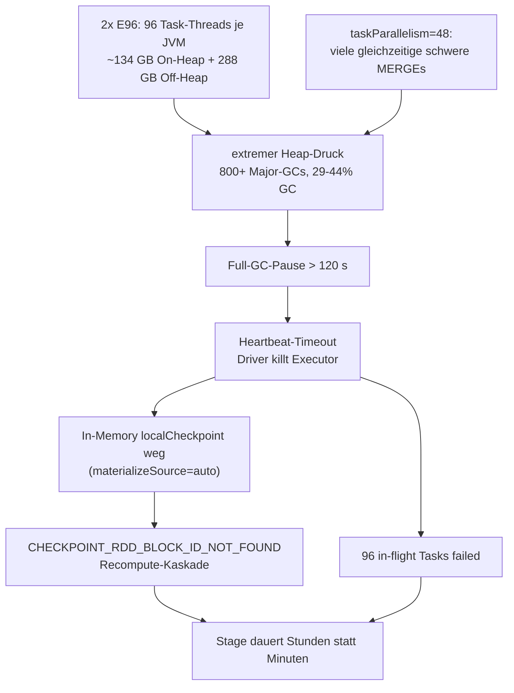

# Spark-Analyse — prod `lakehouse-sr` (Cluster `0606-211209-tva81g5c`)

> Aufgenommen am 2026-06-07 über die Databricks REST-/Spark-UI-Proxy-API
> (siehe [DATABRICKS_REST.md](DATABRICKS_REST.md)). App-Laufzeit zum Zeitpunkt der
> Aufnahme ≈ 9,4 h, App-ID `app-20260606211631-0000`, `spark_context_id`
> `3336557531677485669`. Workspace = prod (`adb-7405608343332957.17`).

## TL;DR

- **Executoren sterben nicht an Logikfehlern, sondern an GC.** Cluster-weit gehen
  **29 % der gesamten Executor-Zeit für GC** drauf (1289 von 4500 min), CPU nur 36 %.
  Einzelne Executoren machen **800+ Major- (Full-/Stop-the-World-)GCs**; ein einziger
  Full-GC auf dem ~134 GB-Heap dauert länger als das 120-s-Heartbeat-Fenster → der
  Driver erklärt den Executor für tot (*"heartbeat timed out after 125–176 s"*).
- **"Failed Tasks" sind fast ausschließlich Kollateral­schaden der Executor-Tode**
  (jeder sterbende Executor markiert seine 96 in-flight Tasks als `failed`) plus
  AQE-Cancels — **keine** echten Fehler. Nur 3 Stages stehen auf `FAILED`, alle mit
  `[SPARK_JOB_CANCELLED] … Adaptive query execution has replanned …` (harmlos).
- **"Zu viele active stages" (deine Vermutung) ist nur halb die Ursache.** Es sind
  zwar 46 aktive Stages, aber nur ~1–2 haben tatsächlich laufende Tasks; der Rest ist
  eingereiht (`numActiveTasks=0`). Der echte Hebel ist nicht die Stage-Anzahl in der
  UI, sondern die **Anzahl gleichzeitiger schwerer MERGEs** (`taskParallelism=48`),
  die sich denselben JVM-Heap teilen und so die GC-Todesspirale füttern.
- **Ein in den Repo-Notizen als "umgesetzt" vermerkter Fix
  (`spark.databricks.delta.merge.materializeSource=none`) ist im laufenden Cluster
  NICHT aktiv** und steht auch nicht in `Config.scala`. Das ist die wahrscheinlichste
  Quelle der `CHECKPOINT_RDD_BLOCK_ID_NOT_FOUND`-Kaskade nach Executor-Verlust.

---

## 1. Standard-/Ist-Konfiguration des Clusters (Snapshot)

| Feld | Wert |
|---|---|
| `cluster_name` | `job-692089632544750-run-130261598401073-sr-cluster` (RunName `lakehouse-sr`) |
| `state` | RUNNING |
| `spark_version` / engine | `17.3.x-scala2.13` / **PHOTON** |
| Worker-Knoten | **2 × `Standard_E96ds_v5`** (autoscale min=max=2, fix) |
| Driver-Knoten | `Standard_E16ds_v5` |
| `cluster_cores` | **208** (2×96 Worker + 16 Driver) |
| `cluster_memory_mb` | 1 507 328 (~1,47 TiB) |
| `autotermination_minutes` | 0 (aus) |
| `data_security_mode` | SINGLE_USER |
| `policy_id` | `0009D8E7AF32CDAF` |
| `azure_attributes` | `first_on_demand=1`, `ON_DEMAND_AZURE`, `spot_bid_max_price=100` |

> Hinweis: Der Kommentar in `Config.scala` (`srConfig`) beschreibt bereits den Plan
> „2–3 kleinere E32-Worker statt einer fetten E96"; der **Code setzt aber weiterhin
> `prod = Standard_E96ds_v5`**. Ist-Zustand = 2× E96.

### Aktive `spark_conf` (wie auf dem Cluster gesetzt)

```
spark.scheduler.mode                                   = FAIR
spark.scheduler.allocation.file                        = file:/tmp/fairscheduler.xml
spark.databricks.preemption.enabled                    = false
spark.databricks.aggressiveWindowDownS                 = 600
spark.sql.autoBroadcastJoinThreshold                   = 33554432   (32 MB)
spark.sql.adaptive.autoBroadcastJoinThreshold          = 33554432   (32 MB)
spark.sql.files.maxPartitionBytes                      = 33554432   (32 MB)
spark.sql.adaptive.advisoryPartitionSizeInBytes        = 33554432   (32 MB)
spark.sql.adaptive.coalescePartitions.minPartitionSize = 16MB
spark.sql.adaptive.coalescePartitions.initialPartitionNum = 768     (2*96*4)
spark.sql.objectHashAggregate.sortBased.fallbackThreshold = 4096
spark.databricks.delta.optimizeWrite.enabled           = true
spark.databricks.delta.autoCompact.enabled             = true
spark.databricks.io.cache.enabled                      = true
```

**Fehlt (obwohl in Repo-Memory als „FIX umgesetzt" notiert):**
`spark.databricks.delta.merge.materializeSource` → läuft also auf Default `auto`
(= In-Memory `localCheckpoint`, der bei Executor-Verlust verloren geht).

---

## 2. Executoren — Tode & Failures

Nur **2 physische Worker** (`10.51.160.106`, `10.51.160.100`), aber **9 Executor-IDs
(0–8)** über die Laufzeit → Executoren sterben und werden wiederholt neu gestartet.
Verteilung: Knoten `.106` durchlief Executor 0→2→4→5→6→7→8 (7 Stück), Knoten `.100`
durchlief 1→3.

| Exec | Knoten | aktiv | failedTasks | GC/Run | removeReason |
|---|---|---|---|---|---|
| 0 | .106 | nein | 96 | 1 % | heartbeat timed out after **154 503 ms** |
| 1 | .100 | nein | 341 | 2 % | heartbeat timed out after **137 977 ms** |
| 2 | .106 | nein | 442 | — | heartbeat timed out after **176 101 ms** |
| 3 | .100 | **ja** | 350 | 19 % | — |
| 4 | .106 | nein | 96 | 8 % | heartbeat timed out after **125 831 ms** |
| 5 | .106 | nein | 96 | 16 % | heartbeat timed out after **139 300 ms** |
| 6 | .106 | nein | 301 | 9 % | heartbeat timed out after **129 150 ms** |
| 7 | .106 | nein | 96 | 22 % | heartbeat timed out after **152 897 ms** |
| 8 | .106 | **ja** | 21 | 9 % | — |

- Alle Tode = **Heartbeat-Timeout (120 s Default) bei 125–176 s** — d. h. die JVM war
  länger als 2 min „eingefroren" (Full-GC), nicht abgestürzt.
- Das wiederkehrende Muster **`failedTasks == 96 == maxTasks`** (Exec 0,4,5,7) zeigt:
  beim Tod werden alle 96 in-flight Tasks auf einen Schlag als `failed` gezählt →
  die „vielen failed tasks" sind Symptom, nicht Ursache.

---

## 3. Längste / teuerste Stages

| Stage | Pool | Wall | tasks | failed | diskSpill | shuffleWrite | input | GC-Anteil |
|---|---|---|---|---|---|---|---|---|
| **79516** | lakehouse-2 | **3755 s (62 min)** | 270 | 74 | **276 GB** | 293 GB | 105 GB | **44 %** |
| 81759 | lakehouse-2 | 1183 s (20 min) | 194 | 0 | 145 GB | 164 GB | 72 GB | 11 % |
| 82535 | — | 363 s | 8 | 0 | 5,7 GB | 6 GB | 0,2 GB | — |
| 85005 | — | 204 s | 8 | 0 | 1,8 GB | 3 GB | — | — |

Detail Stage **79516** (`mapPartitionsInternal at PhotonExec.scala:857`, der große sr-MERGE):

- `executorRunTime` (Summe) = **2583 min** (43 h Core-Zeit) für 62 min Wall → massiv Warten/Recompute.
- `executorCpuTime` = 810 min → **CPU nur 31 %** der Run-Zeit.
- `jvmGcTime` = **1133 min → 44 % der Run-Zeit in GC**.
- `peakExecutorMetrics`: JVMHeap **133,7 GB**, OffHeapExecution **288,5 GB**,
  **MajorGCCount = 825**, MajorGCTime = **2006 s (33 min) Full-GC** auf EINEM Executor.
- 74 Task-Failures = genau die Executor-Tode während dieser Stage.

> Ein 133-GB-Heap mit 96 gleichzeitigen Task-Threads + Full-GC-Pausen > 120 s ⇒
> Heartbeat-Timeout ⇒ Executor-Tod ⇒ In-Memory-`localCheckpoint`-Blöcke weg
> (`materializeSource=auto`) ⇒ `CHECKPOINT_RDD_BLOCK_ID_NOT_FOUND` ⇒ Recompute-Kaskade
> ⇒ Stage dauert Stunden statt Minuten.

---

## 4. Portfolio (889 abgeschlossene/fehlgeschlagene Stages)

| Metrik | Wert |
|---|---|
| `executorRunTime` | 4500 min |
| `executorCpuTime` | 1619 min → **CPU = 36 %** |
| `jvmGcTime` | 1289 min → **GC = 29 %** |
| diskSpill gesamt | **444 GB** |
| shuffleWrite gesamt | 500 GB |
| input gesamt | 229 GB |

→ **~⅓ der bezahlten Cluster-Rechenzeit verpufft in Garbage Collection.**
Mehrere kurze Stages (5–9 min) liegen bei **44–65 % GC** trotz 0 Spill — der JVM ist
also dauerhaft im GC-Druck, unabhängig von der Stage-Größe.

### Aktive Stages / Jobs (Moment­aufnahme)

46 aktive Stages, 7 PENDING — aber nur 1–2 mit echten laufenden Tasks
(z. B. Stage 85032: 187 aktive Tasks von 200), der Rest hat `numActiveTasks=0`.
0 Stage-Retries (`attemptId>0`) im Retain-Fenster; 3 `FAILED` = AQE-Replanning-Cancels.

---

## 5. Ursachenkette (zusammengefasst)



---

## 6. Empfehlungen

> **Status 2026-06-07:** Alle Punkte unten sind inzwischen in
> [Config.scala](src/main/scala/ct/dna/lakehouse/deploy/Config.scala) umgesetzt
> (kompiliert) — **noch nicht deployed/gebenchmarkt**. Konkret gewählte Werte siehe
> Abschnitt 8.

### A) Uneingeschränkt (hohe Sicherheit, geringes Risiko) — sofort umsetzen

1. **`spark.databricks.delta.merge.materializeSource=none` deployen.** ✅ jetzt in `Config.scala`.
   Stand in der Repo-Memory als „umgesetzt", war aber WEDER im laufenden `spark_conf`
   NOCH in `Config.scala`. Stoppt den In-Memory-`localCheckpoint`, der bei Executor-Tod
   verloren geht → bricht die `CHECKPOINT_RDD_BLOCK_ID_NOT_FOUND`-Recompute-Kaskade.
   Determinismus des Source-Reads wurde bereits bestätigt → sicher. Höchster ROI, quasi gratis.
2. **Von 2× E96 auf mehr, kleinere Worker wechseln.** ✅ jetzt **4× `Standard_E48ds_v5`**
   (= gleiche 192 aggregierte Cores, aber halber Heap/JVM). Kleinere JVM-Heaps ⇒ kurze
   GC-Pausen ⇒ keine Heartbeat-Timeouts mehr. Größter Einzelhebel gegen „Executoren sterben".

### B) Benchmark-Kandidaten (A/B messbar) — über Bench testen

| # | Knopf | Status | Erwartung | Messgröße |
|---|---|---|---|---|
| 3 | `taskParallelism` prod **48 → 24** (sr) | ✅ gesetzt (24) | weniger gleichzeitige MERGEs ⇒ weniger Peak-Heap ⇒ weniger GC | Wall-Zeit, GC %, # Executor-Tode |
| 4 | `advisoryPartitionSizeInBytes` **32 → 16 MB** (+ Floor 16→8 MB) | ✅ gesetzt | kleinere Tasks ⇒ weniger Spill & Task-Memory | diskSpill GB, Stage-Dauer |
| 5 | `spark.sql.shuffle.partitions` explizit (statt Default 200) | ✅ gesetzt (=`initialPartitionNum`) | beendet die „genau 200 Tasks"-Stages; großes Fan-out, AQE coalesct klein zurück | # 200-Task-Stages, Stage-Dauer |
| 6 | `spark.network.timeout` **120 → 300 s** | ✅ gesetzt | Pflaster: lange GC tötet Executor nicht sofort | # Executor-Tode |
| 7 | (optional, NICHT gesetzt) `maxPartitionBytes` 32→16 MB / G1-Heap-Tuning | ⬜ offen | wird mit kleineren Knoten ggf. obsolet | GC %, Read-Tasks |

> Reihenfolge für den Benchmark: erst **(1)+(2)** als neue Baseline messen, dann
> **(3)**, **(4)** und **(5)** einzeln dagegen. **(6)** ist Absicherung und kann
> dauerhaft bleiben.

---

## 8. Konkret umgesetzte Werte (Config.scala, sr/prod)

| Knopf | vorher | nachher |
|---|---|---|
| Worker | 2× `E96ds_v5` | **4× `E48ds_v5`** (`min=max=4`, dev/qual bleibt 2× E16) |
| `taskParallelism` (sr prod) | 48 | **24** |
| `advisoryPartitionSizeInBytes` | 32 MB | **16 MB** |
| `coalescePartitions.minPartitionSize` | 16 MB | **8 MB** |
| `coalescePartitions.initialPartitionNum` (sr prod) | `2*96*4`=768 | `4*48*4`=**768** (Wert gleich, Ausdruck angepasst) |
| `spark.sql.shuffle.partitions` (sr prod) | — (Default 200) | **768** (dm/dw prod 128) |
| `spark.network.timeout` | — (Default 120 s) | **300 s** |
| `spark.databricks.delta.merge.materializeSource` | — (Default `auto`) | **`none`** |

`dm_md`/`dw_tx` behalten bewusst ihre 2× `E16ds_v5`-Form (sie fahren nicht die schweren
sr-MERGEs); ihr Worker-Count ist explizit auf 2 gepinnt, da `srConfig` prod jetzt auf 4
defaultet. `shuffle.partitions` ist dort konsistent zur jeweiligen `initialPartitionNum`
gesetzt. Read-Split (`maxPartitionBytes`) wurde bewusst **nicht** angefasst.

---

## 7. Roh-Artefakte

Über den Driver-Proxy gezogen (siehe [DATABRICKS_REST.md](DATABRICKS_REST.md)),
lokal unter `/tmp/dbx/` zwischengespeichert (flüchtig, kein Commit):
`cluster.json`, `apps.json`, `allexecutors.json`, `executors.json`, `jobs.json`,
`stages.json`.
