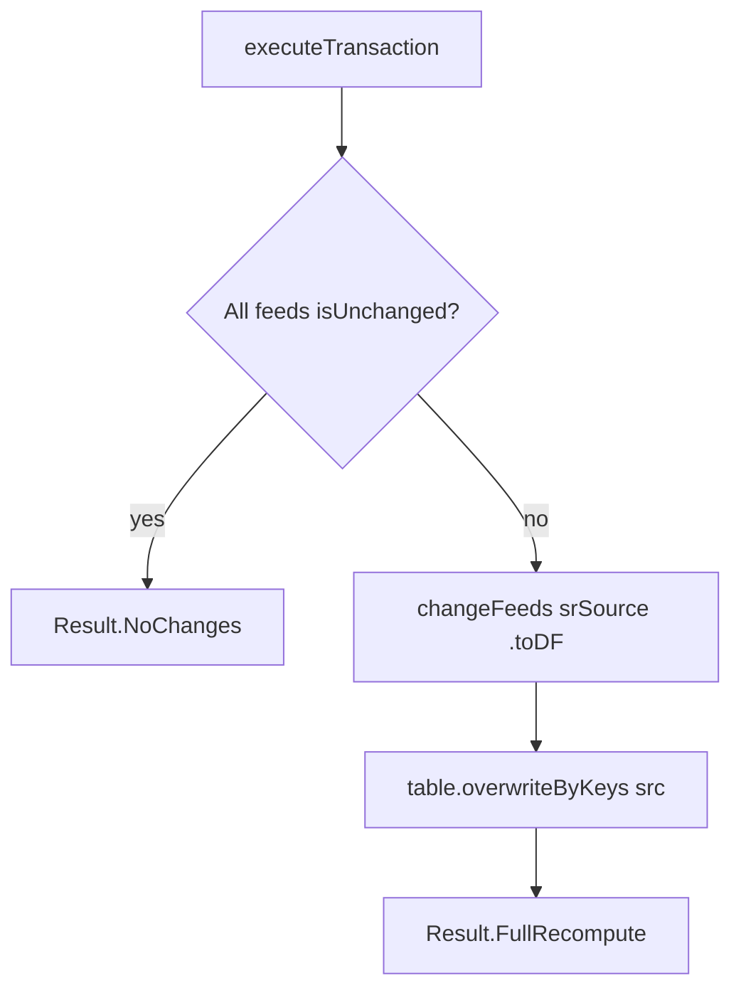

# COUNTRIES\_WW Workflow — SR Raw Pass-through with `overwriteByKeys`

**File:** [`countries_ww.scala`](../../src/main/scala/ct/dna/lakehouse/dm_md/fin_hawk/countries_ww.scala)
**Pattern:** [C — derived join + `overwriteByKeys`](./README.md#pattern-c--derived-join--overwritebykeys-full-recompute)
**Output:** `Result.FullRecompute`

## Purpose

Publishes the global country / geo-enrichment reference table (`mn_gbl_spcustoms.countries_ww`) into the `fin_hawk` schema as a DM table.

The source is a `Loaded` SR-raw table. This wrapper promotes it into the `fin_hawk` layer so that downstream fin_hawk consumers (e.g. `mdp`) can reference a single schema-local source rather than reaching across into `sr_raw`.

## Target schema

| Column | Type | Constraint | Description |
|---|---|---|---|
| `_mk_instance` | String | **PK** | Lakehouse instance |
| `_mk_partition` | String | **PK** | Source partition |
| `_mk_file` | String | **PK** | Source file name |
| `_lh_id_in_message` | Long | **PK** | Row ID within the source message |
| `_mk_org` | String | NotNull | Organisation |
| `_mk_site` | String | NotNull | Site |
| `_mk_system` | String | NotNull | System ID |
| `_mk_container` | String | NotNull | Storage container |
| `_mk_account` | String | NotNull | Storage account |
| `_mk_created_at` | Timestamp | NotNull | Ingest timestamp |
| `_lh_ingest_warning` | String | | Ingest warning message |
| `alpha_2_string` | String | | ISO 3166-1 alpha-2 country code — used as business join key |
| `alpha_3_string` | String | | ISO 3166-1 alpha-3 country code |
| `name_string` | String | | Country name |
| `country_code_string` | String | | Numeric country code |
| `region_string` | String | | World region |
| `region_code_string` | String | | Region code |
| `sub_region_string` | String | | Sub-region name |
| `sub_region_code_string` | String | | Sub-region code |
| `sub_region_short_string` | String | | Sub-region short name |
| `intermediate_region_string` | String | | Intermediate region name |
| `intermediate_region_code_string` | String | | Intermediate region code |
| `iso_3166_2_string` | String | | ISO 3166-2 subdivision code |
| `eco_regions_string` | String | | Eco-region classification |
| `latitude_geo_center_string` | String | | Latitude of geographic centre |
| `longitude_geo_center_string` | String | | Longitude of geographic centre |
| `member_of_eu_string` | String | | EU membership flag (string) |
| `member_of_eu_long` | BoxedLong | | EU membership flag (long) |
| `latitude_geo_center_double` | BoxedDouble | | Latitude (double) |
| `longitude_geo_center_double` | BoxedDouble | | Longitude (double) |
| `region_code_long` | BoxedLong | | Region code (long) |
| `sub_region_code_long` | BoxedLong | | Sub-region code (long) |
| `intermediate_region_code_long` | BoxedLong | | Intermediate region code (long) |
| `country_code_long` | BoxedLong | | Numeric country code (long) |

## Sources

- `ct.dna.lakehouse.sr_raw.mn_gbl_spcustoms.countries_ww` — global country reference (`Loaded` table with CDF, aliased internally as `srSource` to avoid name collision with the local `fin_hawk.countries_ww` object).

## Execution flow



1. Short-circuit `Result.NoChanges` if the sr_raw feed is `isUnchanged`.
2. Read the full current state of the sr_raw source via `changeFeeds(srSource).toDF()`.
3. Write to `fin_hawk` schema with `table.overwriteByKeys(src)` — replaces the entire table content on every run.

## Notes

### Why `overwriteByKeys` and not a real merge?

`countries_ww` is a `Loaded` (file-drop) table, not a CDC stream. There is no `_change_type` column. Every run the full dataset is available, making `overwriteByKeys` the correct and simplest write strategy — identical to the approach used in `mdm`, `mdp`, and `mo`.

### Why a local `fin_hawk` DM wrapper?

The sr_raw source lives in `ct.dna.lakehouse.sr_raw.mn_gbl_spcustoms`. Making it a DM table in `fin_hawk`:
- Keeps all `fin_hawk` sources within the same schema layer.
- Allows the framework to track `countries_ww` as a declared dependency of downstream tables (e.g. `mdp`).
- Lets the `isUnchanged` guard on `mdp` short-circuit correctly when `countries_ww` has not changed.

### `alpha_2_string` is the business join key — not a PK here

The table's actual PK is `(_mk_instance, _mk_partition, _mk_file, _lh_id_in_message)`. The same `alpha_2_string` can legitimately appear in multiple rows (different file ingests). Downstream consumers that join on `alpha_2_string` (e.g. `mdp`) must deduplicate to one row per `alpha_2_string` before joining — see [`MDP_WORKFLOW.md`](./MDP_WORKFLOW.md#countries_ww-dedup-the-key-correctness-bit).

## Validation

```scala
require(sourceTableSpecs.toSet == Set(srSource), ...)
```

Asserts that the single source is `sr_raw.mn_gbl_spcustoms.countries_ww`.
