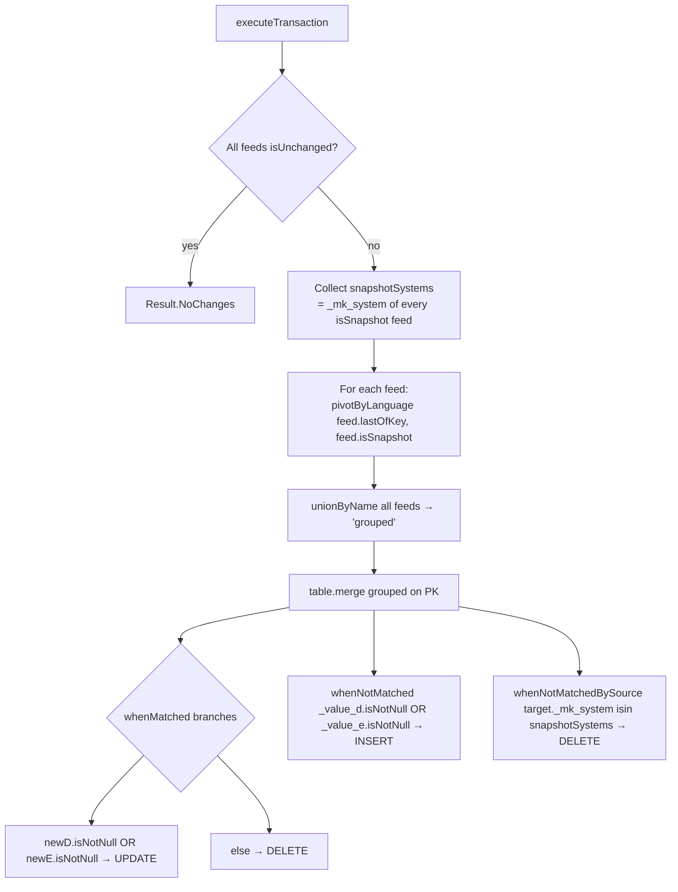

# MAKT Workflow — CDC Merge with Language Pivot (D/E)

**File:** [`makt.scala`](../../src/main/scala/ct/dna/lakehouse/dm_md/fin_hawk/makt.scala)
**Pattern:** [B — language-pivoted CDC merge](./README.md#pattern-b--multi-source-cdc-merge-with-language-pivot-de)
**Output:** `Result.Merged`

## Purpose

Aggregates SAP material descriptions from 13 source systems into one denormalized row per `(_mk_system, _mk_instance, matnr)`, keeping only German (`D`) and English (`E`) text.

## Target schema

| Column | Type | Description |
|---|---|---|
| `_mk_system` | String **PK** | SAP system ID |
| `_mk_instance` | String **PK** | SAP instance |
| `matnr` | String **PK** | Material number |
| `spras` | String | Derived: `"D"`, `"E"`, or `"D;E"` — only languages with non-null text |
| `maktx` | String | Derived: `"<D>~~<E>"` — `concat_ws("~~", _maktx_d, _maktx_e)` |
| `_maktx_d` | String | German text (nullable) |
| `_maktx_e` | String | English text (nullable) |

## Sources

`makt` from each of: `ct_gbl_e32`, `ct_gbl_epp`, `ct_gbl_ghp`, `ct_gbl_p12`, `ct_gbl_p24`, `ct_gbl_p43`, `ct_gbl_p61`, `ct_gbl_p64`, `ct_gbl_p69`, `ct_gbl_p73`, `ct_gbl_p77`, `ct_gbl_p85`, `ct_gbl_pbr`, `ct_gbl_psp`.

Each source PK: `(_mk_system, _mk_instance, matnr, spras)`.

## Execution flow



## `pivotByLanguage`

For each feed, `lastOfKey()` emits one row per `(_mk_system, _mk_instance, matnr, spras)` with `_change_type ∈ {insert, update, delete}`. The pivot collapses the up-to-2 language rows per material into one row with four columns:

| Output column | Meaning |
|---|---|
| `_value_d` | New German text — populated when `spras=D` AND `_change_type != delete`; otherwise `null` |
| `_value_e` | New English text — same rule for `E` |
| `_changed_d` | `true` iff there was *any* event (insert/update OR delete) for D in this batch. Forced to `true` for snapshot feeds. |
| `_changed_e` | Same for E |

The (`_value_x`, `_changed_x`) pair encodes three states unambiguously:

| `_change_type` for X | `_changed_x` | `_value_x` |
|---|---|---|
| `insert`/`update` | `true` | new text |
| `delete` | `true` | `null` |
| no event for X | `false` | `null` |

For **snapshot feeds**, `_changed_x` is unconditionally `true` because a snapshot row is the complete current state — any language not present in the snapshot must be cleared.

## Merge logic

`grouped` is unioned across all feeds, then merged into `target` on `(_mk_system, _mk_instance, matnr)`.

```scala
val newD = when(source._changed_d, source._value_d).otherwise(target._maktx_d)
val newE = when(source._changed_e, source._value_e).otherwise(target._maktx_e)
```

- If the source carried an event for X → take `_value_x` (upsert text or `null` for delete).
- Otherwise → keep what the target already has (carry-forward).

### Branches

| Branch | Condition | Action |
|---|---|---|
| `whenMatched` | `newD.isNotNull OR newE.isNotNull` | UPDATE `spras`, `maktx`, `_maktx_d`, `_maktx_e` |
| `whenMatched` | (else) | DELETE row |
| `whenNotMatched` | `source._value_d.isNotNull OR source._value_e.isNotNull` | INSERT (uses `source._value_*` only — target columns are `null` for new rows so `newX` collapses to source) |
| `whenNotMatchedBySource` | `target._mk_system isin snapshotSystems` | DELETE — target row has no counterpart in a snapshot feed → upstream deletion |

`spras` and `maktx` are computed inline:

```scala
newSpras = concat_ws(";", when(newD.isNotNull, "D"), when(newE.isNotNull, "E"))
newMaktx = concat_ws("~~", newD, newE)
```

## Worked example

### Initial target

| matnr | spras | maktx | _maktx_d | _maktx_e |
|---|---|---|---|---|
| MAT-001 | D;E | Schraube~~Bolt | Schraube | Bolt |
| MAT-002 | D | Mutter | Mutter | *null* |
| MAT-003 | E | Washer | *null* | Washer |

### CDF batch (one CDF feed)

| matnr | spras | maktx | _change_type |
|---|---|---|---|
| MAT-001 | D | Bolzen | update |
| MAT-002 | D | — | delete |
| MAT-004 | D | Feder | insert |
| MAT-004 | E | Spring | insert |

### After `pivotByLanguage`

| matnr | _value_d | _value_e | _changed_d | _changed_e |
|---|---|---|---|---|
| MAT-001 | Bolzen | *null* | true | false |
| MAT-002 | *null* | *null* | true | false |
| MAT-004 | Feder | Spring | true | true |

### Merge outcomes

| matnr | newD | newE | Branch | Result |
|---|---|---|---|---|
| MAT-001 | `Bolzen` (source) | `Bolt` (target carry-forward) | UPDATE | `D;E / Bolzen~~Bolt` |
| MAT-002 | `null` (source delete) | `null` (target was null) | DELETE | row removed |
| MAT-003 | — not in source — | — not in source — | not touched | unchanged |
| MAT-004 | `Feder` | `Spring` | INSERT | `D;E / Feder~~Spring` |

### Final target

| matnr | spras | maktx | _maktx_d | _maktx_e |
|---|---|---|---|---|
| MAT-001 | D;E | Bolzen~~Bolt | Bolzen | Bolt |
| MAT-003 | E | Washer | *null* | Washer |
| MAT-004 | D;E | Feder~~Spring | Feder | Spring |

## Snapshot semantics

If any feed reports `isSnapshot`, its `_mk_system` ends up in `snapshotSystems`. After all upserts/deletes are processed, `whenNotMatchedBySource` deletes any target row from those systems that has no counterpart in this run's source — closing the loop on rows that were dropped upstream without a CDF delete event. `isin` over an empty `Seq` is always false, so the branch is a no-op when no snapshot feed is present.

## Validation (`validate()`)

Asserts every source `makt` table:
- Has the same key columns as the canonical `ct_gbl_e32.makt`.
- Exposes at least the canonical value columns.
