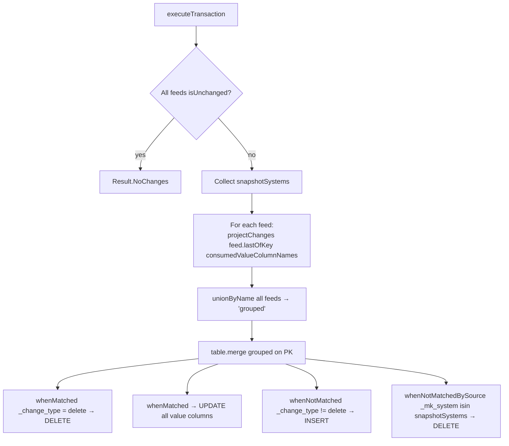

# MARA Workflow — Multi-Source CDC Merge Passthrough

**File:** [`mara.scala`](../../src/main/scala/ct/dna/lakehouse/dm_md/fin_hawk/mara.scala)
**Pattern:** [A — multi-source CDC merge passthrough](./README.md#pattern-a--multi-source-cdc-merge-passthrough)
**Output:** `Result.Merged`

## Purpose

Unions the SAP material master (`mara`) from 13 source systems into one denormalized table keyed by `(_mk_system, _mk_instance, matnr)`. Pure CDC passthrough — no derivations beyond column projection and rename.

## Target schema (PKs + value columns)

| Column | Type | Description |
|---|---|---|
| `_mk_system` | String **PK** | SAP system ID |
| `_mk_instance` | String **PK** | SAP instance |
| `matnr` | String **PK** | Material number |
| `mtart`, `matkl`, `ersda`, `pstat`, `vpsta`, `lvorm`, `meins`, `ferth`, `formt`, `groes`, `wrkst`, `normt`, `meabm`, `prdha`, `attyp`, `mfrpn`, `mfrnr` | String | Pass-through |
| `brgew`, `ntgew` | `Decimal(13,3)` | Weights |
| `volum`, `laeng`, `breit`, `hoehe` | Double | Dimensions |
| `gewei`, `voleh` | String | Units |

## Sources

`mara` from each of: `ct_gbl_e32`, `ct_gbl_epp`, `ct_gbl_ghp`, `ct_gbl_p12`, `ct_gbl_p24`, `ct_gbl_p43`, `ct_gbl_p61`, `ct_gbl_p64`, `ct_gbl_p69`, `ct_gbl_p73`, `ct_gbl_p77`, `ct_gbl_p85`, `ct_gbl_pbr`, `ct_gbl_psp`.

## Execution flow



## `consumedValueColumnNames`

Restricts each `lastOfKey(...)` projection to the columns the merge actually uses. This is **not** an optimization — it sidesteps a real bug:

> Some sr specs (notably the `Joined[E_mara_part1, E_mara_part2]` ones generated for `ct_gbl_epp`/`ct_gbl_ghp`) declare extra `*_string` / `*_decimal_*` fields whose sr-generator-emitted Rename ColumnMods are silently skipped (the generator only validates against the first Entity case class, so part2 renames are dropped under `skipUnusedColumnMod=true`). Those declared field names then do not exist on the underlying Delta table and a default `lastOfKey()` would fail to resolve them.

So `consumedValueColumnNames` is the **explicit allowlist** of columns mara depends on, fed to every `lastOfKey(...)` call.

## `projectChanges`

Slims each feed's `lastOfKey()` output to exactly:

- The 3 PK columns: `_mk_system`, `_mk_instance`, `matnr`.
- Every value column listed in `DmMara` (passed through unchanged).
- The `_change_type` discriminator.

Also `.filter(col("matnr").isNotNull)` to drop CDF rows where the PK is incomplete.

Stripping the rest of the CDF metadata (`_commit_version`, `_commit_timestamp`) keeps the unioned source DataFrame schema-aligned across all 13 sources.

## Snapshot detection

```scala
val snapshotSystems: Set[String] = feeds.collect {
  case (_, feed) if feed.isSnapshot =>
    feed.toDF(Seq("_mk_system")).select(C_mara._mk_system).limit(1).collect().map(_.getString(0)).toSet
}.flatten.toSet
```

`toDF(Seq("_mk_system"))` is used (not the default) for the same `consumedValueColumnNames` reason — defaulting projects the full bad column set.

## Merge branches

| Branch | Condition | Action |
|---|---|---|
| `whenMatched` | `_change_type === "delete"` | DELETE |
| `whenMatched` | (else) | UPDATE all value columns |
| `whenNotMatched` | `_change_type =!= "delete"` | INSERT all PK + value columns |
| `whenNotMatchedBySource` | `target._mk_system isin snapshotSystems` | DELETE — orphaned target row in a snapshot system |

## Validation

Asserts every source `mara` has the canonical key columns and exposes the value columns the merge consumes (uses `ct_gbl_e32.mara` as canonical).
