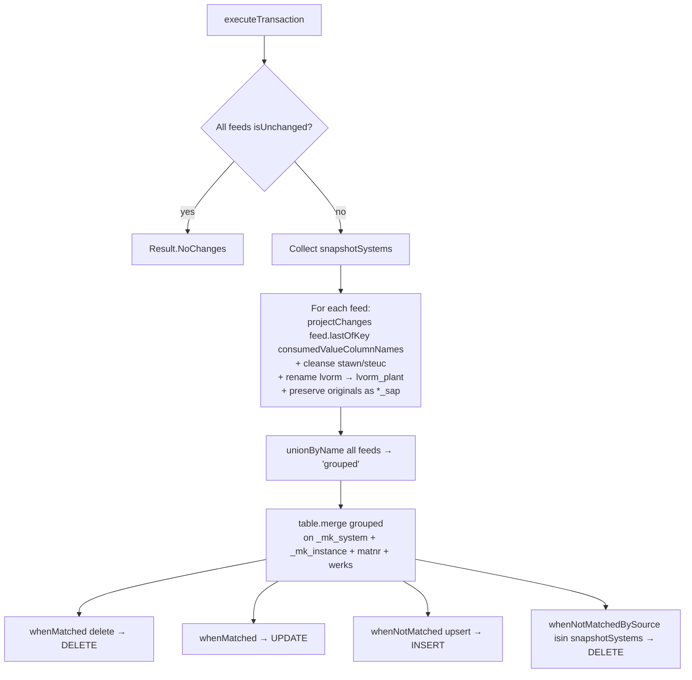

# MARC Workflow — Multi-Source CDC Merge with Cleansing

**File:** [`marc.scala`](../../src/main/scala/ct/dna/lakehouse/dm_md/fin_hawk/marc.scala)
**Pattern:** [A — multi-source CDC merge passthrough](./README.md#pattern-a--multi-source-cdc-merge-passthrough)
**Output:** `Result.Merged`

## Purpose

Unions the SAP plant data for material (`marc`) from 13 source systems into one table keyed by `(_mk_system, _mk_instance, matnr, werks)`. Cleanses `stawn` and `steuc` (HS code variants) by stripping dots and whitespace; preserves the originals as `*_sap`.

## Target schema

| Column | Type | Description |
|---|---|---|
| `_mk_system` | String **PK** | SAP system ID |
| `_mk_instance` | String **PK** | SAP instance |
| `matnr` | String **PK** | Material number |
| `werks` | String **PK** | Plant — note: marc is per-plant, not per-material |
| `lvorm_plant` | String | Renamed from source `lvorm` to disambiguate from `mara.lvorm` |
| `stawn` | String | Cleansed: `regexp_replace(stawn, "\\.|\\s", "")` |
| `steuc` | String | Cleansed: `regexp_replace(steuc, "\\.|\\s", "")` |
| `herkl` | String | Country of origin |
| `stawn_sap` | String | Original `stawn` from SAP, uncleansed |
| `steuc_sap` | String | Original `steuc` from SAP, uncleansed |

## Sources

`marc` from each of: `ct_gbl_e32`, `ct_gbl_epp`, `ct_gbl_ghp`, `ct_gbl_p12`, `ct_gbl_p24`, `ct_gbl_p43`, `ct_gbl_p61`, `ct_gbl_p64`, `ct_gbl_p69`, `ct_gbl_p73`, `ct_gbl_p77`, `ct_gbl_p85`, `ct_gbl_pbr`, `ct_gbl_psp`.

## Execution flow

Same shape as [MARA](./MARA_WORKFLOW.md#execution-flow) — only the projection and PK condition differ.



## `projectChanges` — cleansing inline

```scala
lastOfKey
  .filter(col("matnr").isNotNull)
  .select(
    col("_mk_system"),
    col("_mk_instance"),
    col("matnr"),
    col("werks"),
    col("lvorm").as("lvorm_plant"),
    regexp_replace(col("stawn"), "\\.|\\s", "").as("stawn"),
    regexp_replace(col("steuc"), "\\.|\\s", "").as("steuc"),
    col("herkl"),
    col("stawn").as("stawn_sap"),
    col("steuc").as("steuc_sap"),
    col("_change_type")
  )
```

Cleansing happens once at projection time, not in the merge map. Catalyst then sees the merge as a straight column lookup, keeping the merge plan simple.

## `consumedValueColumnNames`

`Seq("_mk_system", "_mk_instance", "lvorm", "stawn", "steuc", "herkl")` — explicit allowlist passed to `lastOfKey(...)`. Same rationale as in [MARA](./MARA_WORKFLOW.md#consumedvaluecolumnnames): bypass the sr-generator quirk on `Joined` source schemas.

## Merge branches

Identical structure to [MARA](./MARA_WORKFLOW.md#merge-branches). Join condition includes `werks` because that's part of marc's PK:

```scala
source._mk_system === target._mk_system &&
source._mk_instance === target._mk_instance &&
source.matnr === target.matnr &&
source.werks === target.werks
```

## Validation

Asserts canonical keys (matching `ct_gbl_e32.marc`) and required value columns: `lvorm`, `stawn`, `steuc`, `herkl`.
