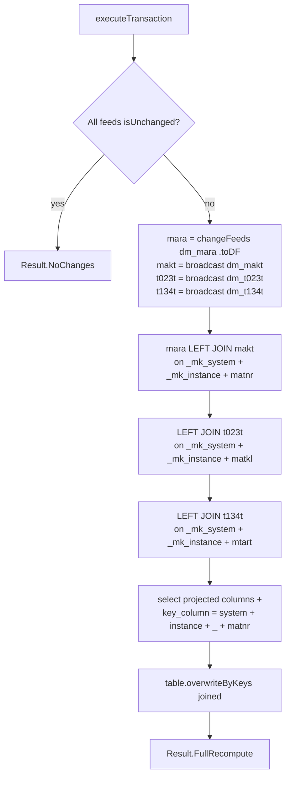

# MDM Workflow — Derived Join with `overwriteByKeys`

**File:** [`mdm.scala`](../../src/main/scala/ct/dna/lakehouse/dm_md/fin_hawk/mdm.scala)
**Pattern:** [C — derived join + `overwriteByKeys`](./README.md#pattern-c--derived-join--overwritebykeys-full-recompute)
**Output:** `Result.FullRecompute`

## Purpose

Denormalises material-master data: enriches every `(_mk_system, _mk_instance, matnr)` from `dm_mara` with its description from `dm_makt`, its material-group description from `dm_t023t`, and its material-type description from `dm_t134t`. One target row per material.

## Target schema

| Column | Type | Description |
|---|---|---|
| `_mk_system` | String | SAP system ID |
| `_mk_instance` | String | SAP instance |
| `key_column` | String **PK** | `concat(_mk_system, _mk_instance, "_", matnr)` |
| `matnr` | String | Material number |
| `mtart`, `matkl`, `ersda`, `pstat`, `vpsta`, `lvorm`, `meins`, `ferth`, `formt`, `groes`, `wrkst`, `normt`, `meabm`, `prdha`, `attyp`, `mfrpn`, `mfrnr` | String | From `dm_mara` |
| `brgew`, `ntgew` | `Decimal(13,3)` | From `dm_mara` |
| `gewei`, `voleh` | String | From `dm_mara` |
| `volum`, `laeng`, `breit`, `hoehe` | Double | From `dm_mara` |
| `spras`, `maktx` | String | From `dm_makt` |
| `spras_t023t`, `wgbez` | String | From `dm_t023t` |
| `spras_t134t`, `mtbez` | String | From `dm_t134t` |

## Sources

- [`dm_mara`](./MARA_WORKFLOW.md) — driving table (1 row per matnr).
- [`dm_makt`](./MAKT_WORKFLOW.md) — material descriptions (1 row per matnr; D/E pre-pivoted upstream).
- [`dm_t023t`](./T023T_WORKFLOW.md) — material-group descriptions (1 row per matkl; D/E pre-pivoted upstream).
- [`dm_t134t`](./T134T_WORKFLOW.md) — material-type descriptions (1 row per mtart; D/E pre-pivoted upstream).

All four are dm-layer tables, so each is already 1-row-per-PK.

## Execution flow

## Grain analysis (why this is safe for `overwriteByKeys`)

`overwriteByKeys` runs a Delta MERGE on `key_column` and **fails if multiple source rows match the same target row**. mdm joins are 1:1:1:

- `dm_mara` PK = `(_mk_system, _mk_instance, matnr)` → 1 row per matnr.
- `dm_makt` PK = `(_mk_system, _mk_instance, matnr)` → 1 row per matnr (the dm-layer `makt` already pivoted `spras` D/E into separate columns, so there's no row-per-language fan-out).
- `dm_t023t` PK = `(_mk_system, _mk_instance, matkl)` → 1 row per matkl (same — pivoted by language).
- `dm_t134t` PK = `(_mk_system, _mk_instance, mtart)` → 1 row per mtart (same — pivoted by language).

Result: each marc row produces exactly one joined row. `key_column` is unique. Safe.

## Notes

- `dm_makt`, `dm_t023t`, and `dm_t134t` are broadcast — all small relative to `dm_mara`, so this becomes a single map-side stage.
- `spras`, `spras_t023t`, and `spras_t134t` are still selected, but they're the pivot's "preferred language" indicator, not row multipliers.

## Validation

`require(sourceTableSpecs.toSet == Set(dm_mara, dm_makt, dm_t023t, dm_t134t))` — guards against an accidental change to the source list that could drop or add a join.
