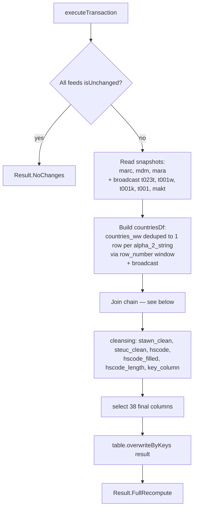
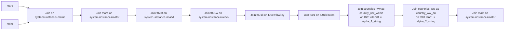

# MDP Workflow — Material × Plant Wide Join with `overwriteByKeys`

**File:** [`mdp.scala`](../../src/main/scala/ct/dna/lakehouse/dm_md/fin_hawk/mdp.scala)
**Pattern:** [C — derived join + `overwriteByKeys`](./README.md#pattern-c--derived-join--overwritebykeys-full-recompute)
**Output:** `Result.FullRecompute`

## Purpose

The widest fin_hawk denormalised table — one row per **material × plant** with everything a downstream consumer needs to reason about HS-code coverage and country/company context: material master, plant, valuation area, company code, plant-country and company-country (enriched from `countries_ww`), plus cleansed HS code (`hscode`).

## Target schema

| Column | Type | Description |
|---|---|---|
| `_mk_system`, `_mk_instance` | String | SAP system / instance |
| `key_column` | String **PK** | `concat(system, instance, "_", matnr, "_", werks)` |
| `matnr`, `maktx`, `lvorm_plant`, `werks` | String | Material + plant identity |
| `mfrnr`, `mfrpn` | String | Manufacturer info (from `dm_mara`) |
| `stawn`, `steuc` | String | Cleansed HS / commodity code |
| `herkl` | String | Country of origin |
| `stawn_sap`, `steuc_sap` | String | Original (uncleansed) values |
| `hscode` | String | Derived: `stawn_clean` if non-empty, else `steuc_clean` |
| `hscode_filled` | Boolean | `hscode != ""` |
| `hscode_length` | Integer | `length(hscode)` |
| `matkl`, `wgbez`, `mtart`, `lvorm` | String | Material group / type / deletion flag |
| `werks_country`, `werks_country_name`, `werks_name`, `plant_code_name` | String | Plant location |
| `company_code`, `company_name`, `company_country`, `company_code_name` | String | Company code (via `werks → bwkey → bukrs`) |
| `cu_country_name` | String | Company-code country name (from `countries_ww`) |
| `werks_member_of_eu`, `cu_member_of_eu` | Long | EU-membership flag (from `countries_ww`) |
| `sap_source`, `sys_name`, `ssid`, `sys_type`, `group_sector`, `active` | — | Currently `lit(null)` placeholders — pending an `sap_systems` reference table |

## Sources

- [`dm_marc`](./MARC_WORKFLOW.md) — driving table: 1 row per `(system, instance, matnr, werks)`.
- [`dm_mdm`](./MDM_WORKFLOW.md) — material master enrichment.
- [`dm_mara`](./MARA_WORKFLOW.md) — manufacturer + matkl.
- [`dm_t023t`](./T023T_WORKFLOW.md) — material-group description.
- [`dm_t001w`](./T001W_WORKFLOW.md) — plant master.
- [`dm_t001k`](./T001K_WORKFLOW.md) — valuation area → company code bridge.
- [`dm_t001`](./T001_WORKFLOW.md) — company code master.
- [`dm_makt`](./MAKT_WORKFLOW.md) — material text.
- `ct.dna.lakehouse.sr_raw.mn_gbl_spcustoms.countries_ww` — global country reference (sr_raw `Loaded` table with CDF).

## Execution flow



### Join chain



All joins are `left`, with marc as the driving side.

## `countries_ww` dedup (the key correctness bit)

`countries_ww` is a `TableSpec[E_countries_ww] with Loaded` whose business PK is `(_mk_instance, _mk_partition, _mk_file, _lh_id_in_message)` — the same `alpha_2_string` can legitimately appear in multiple rows (different ingests / files / instances). Joining on `alpha_2_string` alone would multiply each marc row by N, producing duplicate `key_column`s and triggering `DELTA_MULTIPLE_SOURCE_ROW_MATCHING_TARGET_ROW_IN_MERGE` inside `overwriteByKeys`.

The fix: pre-dedup `countries_ww` to one row per `alpha_2_string`, deterministically picking the most recent file:

```scala
val countriesDf = broadcast(
  changeFeeds(countries_ww).toDF()
    .withColumn("_rn",
      row_number().over(
        Window
          .partitionBy(col("alpha_2_string"))
          .orderBy(col("_mk_created_at").desc_nulls_last,
                   col("_lh_id_in_message").desc_nulls_last)))
    .filter(col("_rn") === 1)
    .drop("_rn")
    .select("alpha_2_string", "name_string", "member_of_eu_string"))
```

Joined twice with different aliases:
- `country_ww_werks` on `t001w.land1` → `werks_country_name`, `werks_member_of_eu`.
- `country_ww_cu` on `t001.land1` → `cu_country_name`, `cu_member_of_eu`.

## `key_column` grain

```scala
concat(marc._mk_system, marc._mk_instance, "_", marc.matnr, "_", marc.werks)
```

`werks` is included because marc's PK is `(_mk_system, _mk_instance, matnr, werks)` and the same matnr can exist in multiple plants. Without `werks` in the key, Delta would see N source rows mapping to one target PK and fail the merge.

## HS-code derivation

```scala
stawn_clean = when(stawn LIKE "00%0" OR steuc LIKE "99%9" OR stawn LIKE "NN", "") otherwise stawn
steuc_clean = same rule applied to steuc
hscode      = if stawn_clean = "" then steuc_clean else stawn_clean
hscode_filled = (hscode != "")
hscode_length = length(hscode)
```

The originals are preserved as `stawn_sap` / `steuc_sap` (passed through from marc's own `*_sap` columns).

## Pending columns

Six target columns are currently `lit(null)` placeholders:

| Column | Source (when available) |
|---|---|
| `sap_source` | `sap_systems.sap_source_string` |
| `sys_name` | `sap_systems.sys_name_string` |
| `ssid` | `sap_systems.ssid_string` |
| `sys_type` | `sap_systems.sys_type_string` |
| `group_sector` | `sap_systems.group_sector_string` |
| `active` | `sap_systems.active_string` cast boolean |

These will be wired up once the `sap_systems` sr_raw table is published.

## Grain analysis (why this is safe for `overwriteByKeys`)

| Join | Right-side rows per marc row | Multiplies rows? |
|---|---|---|
| `dm_mdm` on `(system, instance, matnr)` | ≤1 (mdm is keyed by matnr) | No |
| `dm_mara` on `(system, instance, matnr)` | ≤1 | No |
| `dm_t023t` on `(system, instance, matkl)` | ≤1 (D/E pre-pivoted) | No |
| `dm_t001w` on `(system, instance, werks)` | ≤1 | No |
| `dm_t001k` on `(system, instance, t001w.bwkey)` | ≤1 | No |
| `dm_t001` on `(system, instance, t001k.bukrs)` | ≤1 | No |
| `countries_ww as country_ww_werks` on `t001w.land1` | ≤1 (deduped to 1 per alpha_2) | No |
| `countries_ww as country_ww_cu` on `t001.land1` | ≤1 (deduped) | No |
| `dm_makt` on `(system, instance, matnr)` | ≤1 (D/E pre-pivoted) | No |

Result: each marc row produces exactly one joined row → 1 row per `key_column` → `overwriteByKeys` succeeds.

## Validation

```scala
val expected = Set(dm_marc, dm_mdm, dm_mara, dm_t023t, dm_t001w, dm_t001k, dm_t001, dm_makt, countries_ww)
require(sourceTableSpecs.toSet == expected, ...)
```
