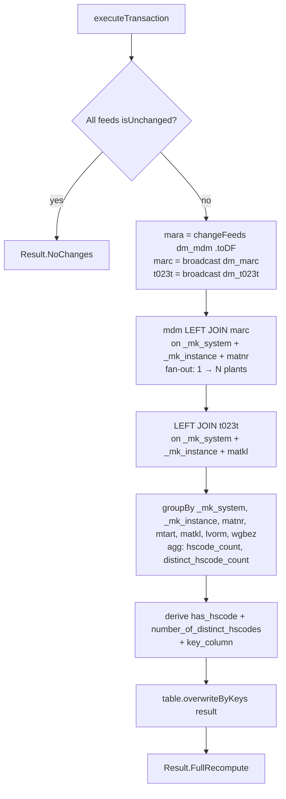

# MO Workflow — Derived Join + Aggregation with `overwriteByKeys`

**File:** [`mo.scala`](../../src/main/scala/ct/dna/lakehouse/dm_md/fin_hawk/mo.scala)
**Pattern:** [C — derived join + `overwriteByKeys`](./README.md#pattern-c--derived-join--overwritebykeys-full-recompute)
**Output:** `Result.FullRecompute`

## Purpose

Computes per-material HS-code coverage statistics. For every `(_mk_system, _mk_instance, matnr)` it counts how many of the material's plant rows in [`marc`](./MARC_WORKFLOW.md) have a non-empty HS code, and how many distinct HS codes those plants use.

## Target schema

| Column | Type | Description |
|---|---|---|
| `_mk_system` | String | SAP system ID |
| `_mk_instance` | String | SAP instance |
| `key_column` | String **PK** | `concat(_mk_system, _mk_instance, "_", matnr)` |
| `matnr` | String | Material number |
| `mtart` | String | Material type (from `dm_mdm`) |
| `matkl` | String | Material group (from `dm_mdm`) |
| `lvorm` | String | Deletion flag at material level (from `dm_mdm`) |
| `wgbez` | String | Material-group description (from `dm_t023t`) |
| `has_hscode` | Boolean | `true` iff at least one plant row has a non-empty `stawn` |
| `number_of_distinct_hscodes` | Long | Distinct count of non-empty `stawn` values across plants |

## Sources

- [`dm_mdm`](./MDM_WORKFLOW.md) — driving table (1 row per matnr).
- [`dm_marc`](./MARC_WORKFLOW.md) — plant data per material (N rows per matnr — one per plant).
- [`dm_t023t`](./T023T_WORKFLOW.md) — material-group descriptions (1 row per matkl).

## Execution flow



## Aggregation

```scala
.agg(
  sum(when(col("marc.stawn") =!= "", 1).otherwise(0)).as("hscode_count"),
  countDistinct(when(col("marc.stawn") =!= "", col("marc.stawn"))).as("distinct_hscode_count")
)
.withColumn("has_hscode", col("hscode_count") > 0)
.withColumn(
  "number_of_distinct_hscodes",
  when(col("hscode_count") === 0, lit(0L)).otherwise(col("distinct_hscode_count"))
)
```

- `hscode_count` = number of plants with a non-empty `stawn` for this material.
- `distinct_hscode_count` is forced to `0` when `hscode_count == 0` (countDistinct of all-null returns 0 anyway, but the explicit `when` makes the intent explicit and resilient if marc returns no rows at all).

## Grain analysis (why this is safe for `overwriteByKeys`)

The marc join intentionally fans out — `dm_marc` PK is `(_mk_system, _mk_instance, matnr, werks)`, so joining on `(system, instance, matnr)` produces N rows per matnr (one per plant). That fan-out is **then collapsed by `groupBy(matnr, …)`** before the write. After the groupBy, exactly 1 row per matnr remains, matching `key_column = system+instance_matnr`. Safe.

`dm_t023t` is 1 row per matkl, so it does not multiply rows.

## Notes

- `dm_marc` and `dm_t023t` are broadcast — both small relative to `dm_mdm`, keeping the join + aggregate on a single shuffle.
- The variable name `maraDf` in the source code refers to `dm_mdm` (left over from when `mdm` was named `mara`). Functionally still the mdm DataFrame.

## Validation

`require(sourceTableSpecs.toSet == Set(dm_mdm, dm_marc, dm_t023t))` — guards the source list.
