# CUSTOMS_REGIONAL_REPORTING Workflow — Wide Join (`overwriteByKeys`)

**File:** [`customs_regional_reporting.scala`](../../src/main/scala/ct/dna/lakehouse/dm_md/fin_redb/customs_regional_reporting.scala)
**Pattern:** [C — derived recompute + `overwriteByKeys`](./README.md#pattern-c--derived-recompute--overwritebykeys-full-recompute)
**Output:** `Result.FullRecompute`

## Purpose

The central denormalised reporting table — one row per **purchase-order position** (`(_mk_system, _mk_instance, ekko_ebeln)` + `ekpo_ebelp`) carrying everything needed for customs/regional analysis: purchasing header & item, vendor, company code, plant, valuation, material master, material-group text, HS code (from the hawk `mdp` table) and its full HS-code-reference description hierarchy, plus derived HS-code prefixes.

## Target schema (highlights)

PK: `(_mk_system, _mk_instance, ekko_ebeln)`. ~100 value columns grouped by source:

| Group | Columns (prefix) | From |
|---|---|---|
| EKKO header | `ekko_*` | [ekko](./EKKO_WORKFLOW.md) |
| EKPO item | `ekpo_*` | [ekpo](./EKPO_WORKFLOW.md) |
| Vendor | `lfa1_*` | [lfa1](./LFA1_WORKFLOW.md) |
| Company | `t001_*` | [t001](./T001_WORKFLOW.md) |
| Valuation | `mbew_*` | [mbew](./MBEW_WORKFLOW.md) |
| Material/plant | `marc_*`, `stawn_international` | [marc](./MARC_WORKFLOW.md) |
| HS code + derived | `hscode`, `hs_code_2/3/5/6/8`, `hs_code_8_6` | hawk `mdp` |
| HS description | `hsc_*` | `sr_raw hs_codes` |
| Material master | `mara_*` | [mara](./MARA_WORKFLOW.md) |
| Material group text | `matkl_text` | [t023t](./T023T_WORKFLOW.md) |
| Plant/geo | `t001w_*` | [t001w](./T001W_WORKFLOW.md) |

## Sources

`ekko`, `ekpo`, `lfa1`, `t001`, `marc`, `mara`, `t023t`, `mbew`, `t001w` (this package), plus:
- `ct.dna.lakehouse.dm_md.fin_hawk.mdp` (aliased `hawk_mdp`) — material-data-plant, source of `hscode`.
- `ct.dna.lakehouse.sr_raw.mn_gbl_spcustoms.hs_codes` (aliased `sr_raw_hscode`) — HS-code reference (`Loaded`).

## Join chain

```mermaid
flowchart LR
    ekko --> J1[LEFT JOIN ekpo on ebeln]
    J1 --> J2[LEFT JOIN lfa1 on lifnr]
    J2 --> J3[LEFT JOIN t001 on bukrs - broadcast]
    J3 --> J4[LEFT JOIN marc on ekpo.werks+matnr]
    J4 --> J5[LEFT JOIN mara on marc.matnr]
    J5 --> J6[LEFT JOIN t023t on mara.matkl - broadcast]
    J6 --> J7[LEFT JOIN mbew on ekpo.werks=bwkey+matnr+bwtar]
    J7 --> J8[LEFT JOIN t001w on ekpo.werks]
    J8 --> J9[LEFT JOIN mdp on marc.werks+matnr]
    J9 --> J10[LEFT JOIN hs_codes on mdp.hscode = cn_code - broadcast, deduped]
    J10 --> K[derive hs_code_* prefixes]
    K --> L[select ~100 cols]
    L --> M[table.overwriteByKeys]
```

All joins are `left`, with `ekko` as the driving side. `t001`, `t023t` and the deduped `hs_codes` are `broadcast` (small dimensions / lookups).

## `hs_codes` dedup (grain safety)

`sr_raw hs_codes` is a `Loaded` reference table — the same `cn_code_string` can appear in multiple rows across ingests. It is deduped to one row per `cn_code_string` (newest ingest wins) via a `row_number` window before the join, to keep the output unique per PK and avoid `DELTA_MULTIPLE_SOURCE_ROW_MATCHING_TARGET_ROW_IN_MERGE` (same technique as [T001W](./T001W_WORKFLOW.md#countries_ww-dedup-the-grain-safety-bit)).

## Derived HS-code columns

`hscodeClean` strips tabs / newlines / carriage-returns / spaces from `mdp.hscode`, then:

- `hs_code_8` = first 8 chars of the **raw** `mdp.hscode`.
- `hs_code_2/3/5/6` = first 2/3/5/6 chars of `hscodeClean`.
- `hs_code_8_6` = `hscodeClean` if shorter than 6 chars, else its first 6 chars.

## Downstream

Consumed by [`import_table`](./IMPORT_TABLE_WORKFLOW.md), joined to `ekbe` on `(_mk_system, _mk_instance, ekko_ebeln = ebeln, ekpo_ebelp = ebelp)`.
</content>
