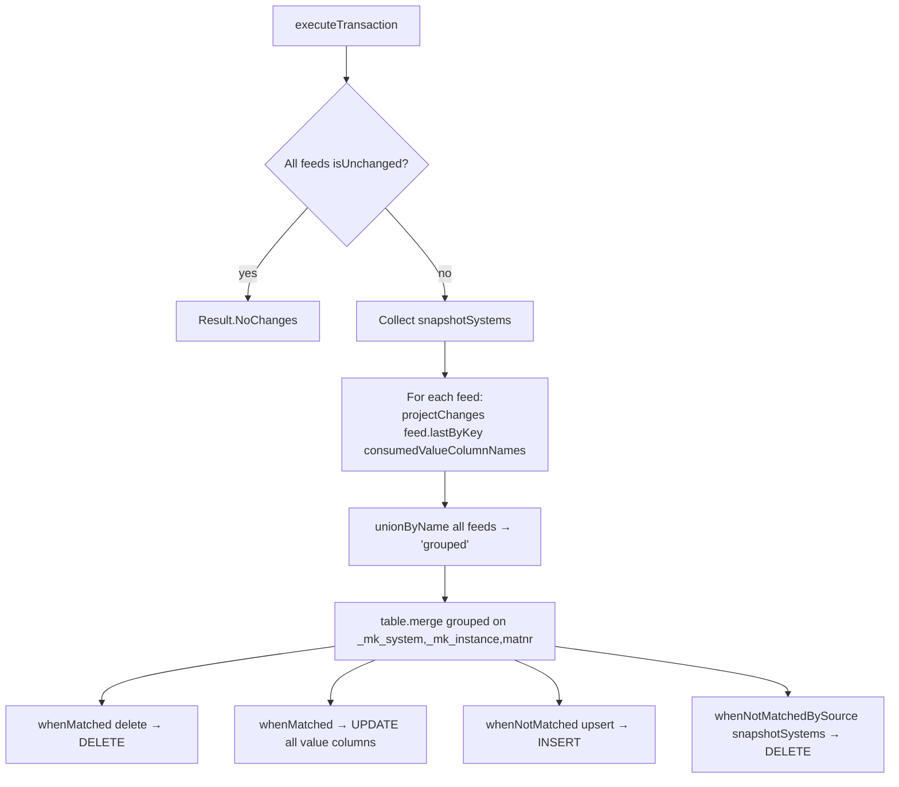

# MARA Workflow — Multi-Source CDC Merge Passthrough

**File:** [`mara.scala`](../../src/main/scala/ct/dna/lakehouse/dm_md/fin_redb/mara.scala)
**Pattern:** [A — multi-source CDC merge passthrough](./README.md#pattern-a--multi-source-cdc-merge-passthrough)
**Output:** `Result.Merged`

## Purpose

Unions the SAP material master (`mara`) from 14 source systems into one denormalised table keyed by `(_mk_system, _mk_instance, matnr)`. Pure CDC passthrough — no derivations beyond column projection.

## Target schema (PKs + value columns)

| Column | Type | Description |
|---|---|---|
| `_mk_system`, `_mk_instance` | String **PK** | SAP system / instance |
| `matnr` | String **PK** | Material number |
| `mtart`, `matkl`, `ersda`, `pstat`, `vpsta`, `lvorm`, `meins`, `ferth`, `formt`, `groes`, `wrkst`, `normt`, `meabm`, `prdha`, `attyp`, `mfrpn`, `mfrnr` | String | Pass-through |
| `brgew`, `ntgew` | `Decimal(13,3)` | Weights |
| `volum`, `laeng`, `breit`, `hoehe` | Double | Dimensions |
| `gewei`, `voleh` | String | Units |

## Sources

`mara` from each of the 14 `ct_gbl_*` systems (same list as [EKBE](./EKBE_WORKFLOW.md#sources)).

## Execution flow

## `consumedValueColumnNames`

Restricts each `lastByKey(...)` projection to the columns the merge actually uses. This is **not** an optimization — it sidesteps a real bug:

> Some sr specs (notably the `Joined[E_*_part1, E_*_part2]` ones generated for `ct_gbl_epp`/`ct_gbl_ghp`) declare extra `*_string` / `*_decimal_*` fields whose sr-generator-emitted Rename ColumnMods are silently skipped (the generator only validates against the first Entity case class, so part2 renames are dropped under `skipUnusedColumnMod=true`). Those declared field names then do not exist on the underlying Delta table and a default `lastByKey()` would fail to resolve them.

So `consumedValueColumnNames` is the **explicit allowlist** of columns mara depends on, fed to every `lastByKey(...)` call. The same allowlist is used for the snapshot-detection probe: `feed.snapshot(Seq("_mk_system"))` projects only `_mk_system` rather than the full (bad) column set.

## Merge branches

Standard four-branch Pattern A (see [EKBE](./EKBE_WORKFLOW.md#merge-branches)).

## Downstream

`mara` supplies material type / group / raw material (`mara_mtart`, `mara_matkl`, `mara_wrkst`) to [`customs_regional_reporting`](./CUSTOMS_REGIONAL_REPORTING_WORKFLOW.md), joined on `(_mk_system, _mk_instance, matnr)` from `marc`.
</content>
