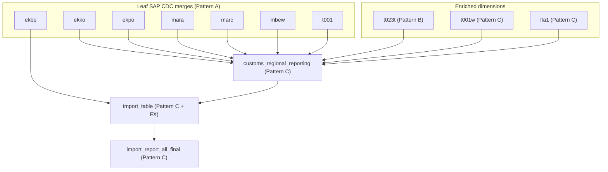

# fin_redb Workflow Docs

Per-table execution-flow documentation for the `ct.dna.lakehouse.dm_md.fin_redb` package. Each doc describes how the table is populated from its sources at runtime, the merge/overwrite strategy used, and the per-table edge cases.

This package builds the **customs / import regional dashboard**: it lands a set of SAP purchasing, material, vendor and plant tables, joins them into one wide reporting row per purchase-order position, converts amounts to EUR via the FX-rates table, and finally reshapes the result into the published dashboard table.

## Table index

| Table | Pattern | Primary key | Purpose |
|---|---|---|---|
| [ekbe](./EKBE_WORKFLOW.md) | A | `_mk_system, _mk_instance, gjahr, vgabe, zekkn, belnr, ebeln, ebelp, buzei` | PO history (goods-receipt / invoice events) — transaction grain |
| [ekko](./EKKO_WORKFLOW.md) | A | `_mk_system, _mk_instance, ebeln` | Purchasing-document header (standard POs only, `bstyp = "F"`) |
| [ekpo](./EKPO_WORKFLOW.md) | A | `_mk_system, _mk_instance, ebeln, ebelp` | Purchasing-document item / position |
| [mara](./MARA_WORKFLOW.md) | A | `_mk_system, _mk_instance, matnr` | Material master |
| [marc](./MARC_WORKFLOW.md) | A | `_mk_system, _mk_instance, matnr, werks` | Material-per-plant master, cleansed HS / commodity codes |
| [mbew](./MBEW_WORKFLOW.md) | A | `_mk_system, _mk_instance, matnr, bwkey, bwtar` | Material valuation (standard price / price unit) |
| [t001](./T001_WORKFLOW.md) | A | `_mk_system, _mk_instance, bukrs` | Company-code master |
| [t023t](./T023T_WORKFLOW.md) | B | `_mk_system, _mk_instance, matkl` | Material-group descriptions (D/E language pivot) |
| [t001w](./T001W_WORKFLOW.md) | C | `_mk_system, _mk_instance, werks` | Plant dimension + country/region enrichment |
| [lfa1](./LFA1_WORKFLOW.md) | C | `_mk_system, _mk_instance, lifnr` | Vendor dimension + country/region enrichment |
| [customs_regional_reporting](./CUSTOMS_REGIONAL_REPORTING_WORKFLOW.md) | C | `_mk_system, _mk_instance, ekko_ebeln` | Wide join — one row per PO position |
| [import_table](./IMPORT_TABLE_WORKFLOW.md) | C | EKBE 9-col key | FX conversion + trade classification + EUR amount |
| [import_report_all_final](./IMPORT_REPORT_ALL_FINAL_WORKFLOW.md) | C | `_mk_system, _mk_instance, gjahr, belnr, ebeln, ebelp, buzei` | Published dashboard reshape |

## Run order

The tables form a DAG, executed in this dependency order:

External (non-package) sources:
- `ct.dna.lakehouse.sr.ct_gbl_*` — per-system SAP source-replicated (sr) tables.
- `ct.dna.lakehouse.sr_raw.mn_gbl_spcustoms.countries_ww` — global country/region reference (used by `t001w`, `lfa1`).
- `ct.dna.lakehouse.sr_raw.mn_gbl_spcustoms.hs_codes` — HS-code reference (used by `customs_regional_reporting`).
- `ct.dna.lakehouse.dm_md.fin_hawk.mdp` — material-data-plant DM table (used by `customs_regional_reporting`).
- `dw_tx.fin_fxrates.fxrates` — FX rates, read directly via `spark.table(...)` (used by `import_table`).

## Pattern catalogue

The tables fall into three execution patterns.

### Pattern A — Multi-source CDC merge passthrough

Used by: [EKBE](./EKBE_WORKFLOW.md), [EKKO](./EKKO_WORKFLOW.md), [EKPO](./EKPO_WORKFLOW.md), [MARA](./MARA_WORKFLOW.md), [MARC](./MARC_WORKFLOW.md), [MBEW](./MBEW_WORKFLOW.md), [T001](./T001_WORKFLOW.md).

Reads 14 homogeneous SAP source tables (one per system: `ct_gbl_e32`, `ct_gbl_epp`, …), each with `(_mk_system, _mk_instance, …)` PKs. For every feed:

1. `feed.lastByKey(consumedValueColumnNames)` → one row per PK with `_change_type ∈ {insert, update, delete}`.
2. `projectChanges(...)` slims the projection (and applies per-table cleansing / sign / date formatting).
3. All per-feed slices are unioned via `unionByName`.
4. `table.merge(...)` runs an explicit Delta MERGE:
   - `whenMatched(_change_type === "delete").delete()`
   - `whenMatched().update(...)`
   - `whenNotMatched(_change_type =!= "delete").insert(...)`
   - `whenNotMatchedBySource(_mk_system isin snapshotSystems).delete()` — only triggers for systems whose feed is `isSnapshot`.

Returns `Result.Merged`.

### Pattern B — Multi-source CDC merge with language pivot (D/E)

Used by: [T023T](./T023T_WORKFLOW.md).

Same as Pattern A, but each source row is keyed by language (`spras`). The pivot collapses up to two language rows per business key into a single row with `_value_d`, `_value_e`, `_changed_d`, `_changed_e` columns. The merge carries forward the target value for an unchanged language, applies upsert/delete for a changed language, deletes when both languages are gone, and falls back to `"No Entry"` when the concatenated text is blank.

### Pattern C — Derived recompute + `overwriteByKeys` (full recompute)

Used by: [T001W](./T001W_WORKFLOW.md), [LFA1](./LFA1_WORKFLOW.md), [CUSTOMS_REGIONAL_REPORTING](./CUSTOMS_REGIONAL_REPORTING_WORKFLOW.md), [IMPORT_TABLE](./IMPORT_TABLE_WORKFLOW.md), [IMPORT_REPORT_ALL_FINAL](./IMPORT_REPORT_ALL_FINAL_WORKFLOW.md).

Reads dm-layer snapshots via `feed.snapshot()` (post-merge consistent state), joins / reshapes them, and writes via `table.overwriteByKeys(result)` which returns `Result.FullRecompute`. No per-row `_change_type` handling — the computed output is the new source of truth for every key it produces.

Important: `overwriteByKeys` runs a Delta MERGE on the PK. **The output must be unique per PK** or Delta raises `DELTA_MULTIPLE_SOURCE_ROW_MATCHING_TARGET_ROW_IN_MERGE`. Each pattern-C doc identifies how its joins preserve grain (typically by deduping `Loaded` reference tables to one row per business key with a `row_number` window).

## Common framework references

- `ChangeFeed.snapshot(...)` — current consistent snapshot of business rows (no CDF metadata). Replaces the deprecated `toDF(...)`.
- `ChangeFeed.lastByKey(...)` — one row per PK from the change interval, with `_change_type` and `_commit_version`. Replaces the deprecated `lastOfKey(...)`.
- `ChangeFeed.isSnapshot` — `true` when no continuous CDF is available; `lastByKey` simulates a full load by emitting all current rows as inserts.
- `ChangeFeed.isUnchanged` — `true` when the known commit equals the current commit; used to short-circuit with `Result.NoChanges`.
- `Table.merge(source, condition)` — explicit Delta MERGE builder; returns `Result.Merged` after `.execute()`.
- `Table.overwriteByKeys(source)` — full recompute MERGE on the table PK; returns `Result.FullRecompute`.

> **API note.** This package uses the current lakehouse-core API (`snapshot` / `lastByKey`). The older `toDF` / `lastOfKey` names referenced in the fin_hawk docs are the deprecated aliases of these same methods.
</content>
</invoke>
