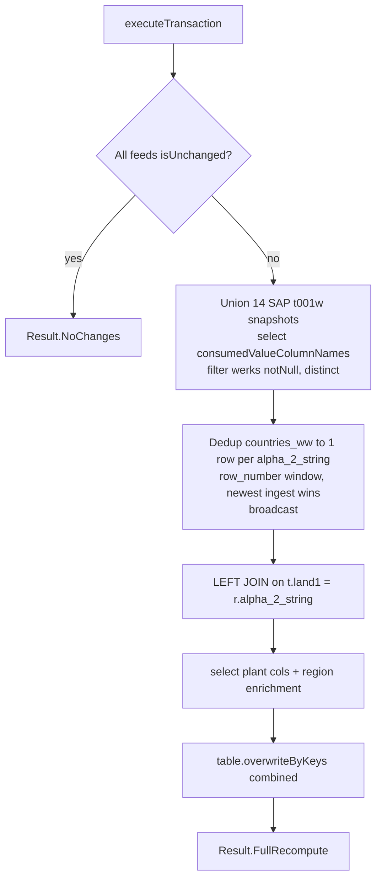

# T001W Workflow — Plant Dimension + Region Enrichment (`overwriteByKeys`)

**File:** [`t001w.scala`](../../src/main/scala/ct/dna/lakehouse/dm_md/fin_redb/t001w.scala)
**Pattern:** [C — derived recompute + `overwriteByKeys`](./README.md#pattern-c--derived-recompute--overwritebykeys-full-recompute)
**Output:** `Result.FullRecompute`

## Purpose

Builds the plant dimension: unions the SAP plant master (`t001w`) from 14 source systems, then left-joins the global country/region reference (`countries_ww`) on the plant country (`land1`) to append geo / economic-region enrichment. Recomputed in full each run.

## Target schema

| Column | Type | Description |
|---|---|---|
| `_mk_system`, `_mk_instance` | String **PK** | SAP system / instance |
| `werks` | String **PK** | Plant |
| `name1`, `bwkey`, `land1`, `kunnr`, `lifnr` | String | Plant attributes from SAP |
| `country`, `iso_code`, `eco_regions`, `subregion` | String | From `countries_ww` (`eco_regions` → `"No Entry"` fallback) |
| `latitude_geo_center` | `Decimal(19,17)` | Geo centroid |
| `longitude_geo_center` | `Decimal(21,18)` | Geo centroid |
| `member_of_eu` | Long | EU-membership flag |

## Sources

- `t001w` from each of the 14 `ct_gbl_*` systems (the `sapTableSpecs`).
- `ct.dna.lakehouse.sr_raw.mn_gbl_spcustoms.countries_ww` (aliased `customs_regions_raw`) — a `Loaded` reference table with CDF.

## Execution flow



Each SAP feed is read via `changeFeeds(ts).snapshot()` (consistent post-merge state), restricted to `consumedValueColumnNames` = `_mk_system, _mk_instance, werks, name1, bwkey, land1, kunnr, lifnr`, then `unionByName`-ed, filtered to non-null `werks`, and `distinct`-ed.

## `countries_ww` dedup (the grain-safety bit)

`countries_ww` is a `Loaded` table — the same `alpha_2_string` can appear in multiple rows across different ingests/files. Joining on it raw would multiply each plant row by N, producing duplicate `(_mk_system, _mk_instance, werks)` keys and triggering `DELTA_MULTIPLE_SOURCE_ROW_MATCHING_TARGET_ROW_IN_MERGE` inside `overwriteByKeys`. The fix dedups to one row per `alpha_2_string`, newest ingest wins:

```scala
row_number().over(
  Window.partitionBy(col("alpha_2_string"))
    .orderBy(col("_mk_created_at").desc_nulls_last, col("_lh_id_in_message").desc_nulls_last))
```

then `filter(_rn === 1)`. The deduped reference is `broadcast`.

## Downstream

`t001w` joins from `ekpo` on `werks` in [`customs_regional_reporting`](./CUSTOMS_REGIONAL_REPORTING_WORKFLOW.md), supplying all the `t001w_*` plant/geo columns (and `t001w_member_of_eu` / `t001w_iso_code` used by the `import_` classification).
</content>
