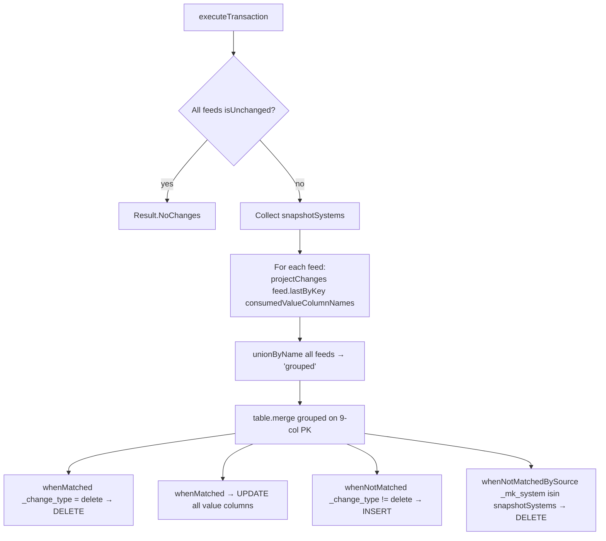

# EKBE Workflow — Multi-Source CDC Merge Passthrough

**File:** [`ekbe.scala`](../../src/main/scala/ct/dna/lakehouse/dm_md/fin_regional_dashboard/ekbe.scala)
**Pattern:** [A — multi-source CDC merge passthrough](./README.md#pattern-a--multi-source-cdc-merge-passthrough)
**Output:** `Result.Merged`

## Purpose

Unions the SAP purchase-order history (`ekbe`, the document-level goods-receipt / invoice events) from 14 source systems into one table keyed by the full nine-column document key. Pure CDC passthrough plus two light transforms: date normalisation and a debit/credit sign flip.

## Target schema (PKs + value columns)

| Column | Type | Description |
|---|---|---|
| `_mk_system`, `_mk_instance` | String **PK** | SAP system / instance |
| `gjahr`, `vgabe`, `zekkn`, `belnr`, `ebeln`, `ebelp`, `buzei` | String **PK** | Document key (year, transaction type, account-assignment, material-doc, PO, item, sequence) |
| `bwart`, `waers`, `shkzg`, `elikz`, `xblnr`, `lsmeh`, `hswae` | String | Pass-through |
| `budat`, `bldat` | String | Dates, normalised to `yyyyMMdd` |
| `menge`, `dmbtr`, `wrbtr`, `reewr`, `lsmng`, `areww` | Double | Quantities / amounts |

## Sources

`ekbe` from each of: `ct_gbl_e32`, `ct_gbl_epp`, `ct_gbl_ghp`, `ct_gbl_p12`, `ct_gbl_p24`, `ct_gbl_p43`, `ct_gbl_p61`, `ct_gbl_p64`, `ct_gbl_p69`, `ct_gbl_p73`, `ct_gbl_p77`, `ct_gbl_p85`, `ct_gbl_pbr`, `ct_gbl_psp`.

## Execution flow

## `projectChanges` transforms

Beyond slimming to PKs + `DmEkbe` value columns + `_change_type`, it:

- **Drops incomplete keys**: `.filter(col("ebeln").isNotNull && col("ebelp").isNotNull)`.
- **Normalises dates**: `budat` and `bldat` are SAP `yyyyMMdd` strings; `"00000000"` is mapped to `null`, then re-formatted via `date_format(to_date(..., "yyyyMMdd"), "yyyyMMdd")`.
- **Sign flip on `dmbtr`**: `when(shkzg === "H", -dmbtr).otherwise(dmbtr)` — credit postings (`H`) are stored negative so downstream EUR conversion sums correctly.

## `consumedValueColumnNames`

Explicit allowlist of source columns fed to every `lastByKey(...)` call, so the projection never resolves columns that some sr specs declare but whose underlying Delta columns don't exist (see [MARA](./MARA_WORKFLOW.md#consumedvaluecolumnnames) for the full background on this sr-generator quirk).

## Merge branches

| Branch | Condition | Action |
|---|---|---|
| `whenMatched` | `_change_type === "delete"` | DELETE |
| `whenMatched` | (else) | UPDATE all value columns |
| `whenNotMatched` | `_change_type =!= "delete"` | INSERT all PK + value columns |
| `whenNotMatchedBySource` | `target._mk_system isin snapshotSystems` | DELETE orphaned target row in a snapshot system |

## Downstream

`ekbe` is consumed by [`import_table`](./IMPORT_TABLE_WORKFLOW.md) as the transaction grain (filtered to `vgabe = '1'`, `gjahr >= 2023`).
</content>
