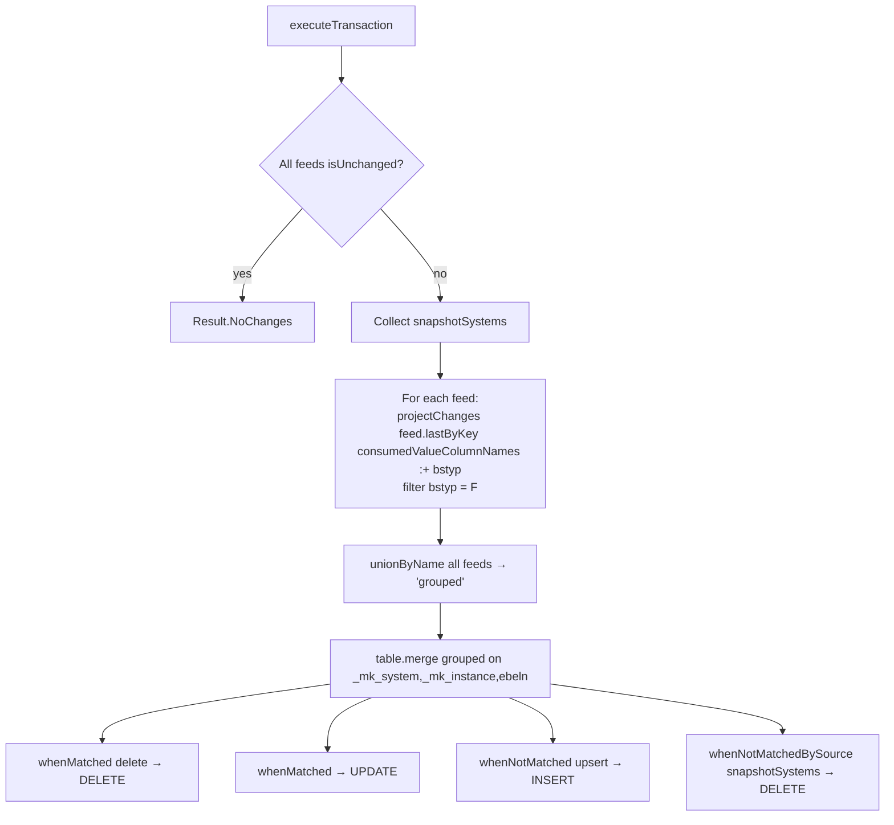

# EKKO Workflow — Multi-Source CDC Merge Passthrough

**File:** [`ekko.scala`](../../src/main/scala/ct/dna/lakehouse/dm_md/fin_regional_dashboard/ekko.scala)
**Pattern:** [A — multi-source CDC merge passthrough](./README.md#pattern-a--multi-source-cdc-merge-passthrough)
**Output:** `Result.Merged`

## Purpose

Unions the SAP purchasing-document **header** (`ekko`) from 14 source systems into one table keyed by `(_mk_system, _mk_instance, ebeln)`. Only standard purchase orders are kept.

## Target schema (PKs + value columns)

| Column | Type | Description |
|---|---|---|
| `_mk_system`, `_mk_instance` | String **PK** | SAP system / instance |
| `ebeln` | String **PK** | Purchasing document number |
| `bukrs` | String | Company code |
| `loekz`, `statu`, `aedat`, `lifnr`, `bsart`, `waers`, `ekorg` | String | Deletion flag, status, change date, vendor, doc type, currency, purchasing org |

## Sources

`ekko` from each of the 14 `ct_gbl_*` systems (same list as [EKBE](./EKBE_WORKFLOW.md#sources)).

## Document-category filter

`projectChanges` keeps only standard purchase orders:

```scala
.filter(col("ebeln").isNotNull && col("bstyp") === "F")
```

`bstyp` is **not** a `DmEkko` value column — it is appended to the projection only for this filter:

```scala
projectChanges(feed.lastByKey(consumedValueColumnNames :+ "bstyp"))
```

so it is available inside `projectChanges` and then dropped by the `select`.

## Execution flow



## Merge branches

Identical four-branch shape as [EKBE](./EKBE_WORKFLOW.md#merge-branches), on the 3-column header key.

## Downstream

`ekko` is the driving table of [`customs_regional_reporting`](./CUSTOMS_REGIONAL_REPORTING_WORKFLOW.md) (left-joined to `ekpo`, `lfa1`, `t001`).
</content>
