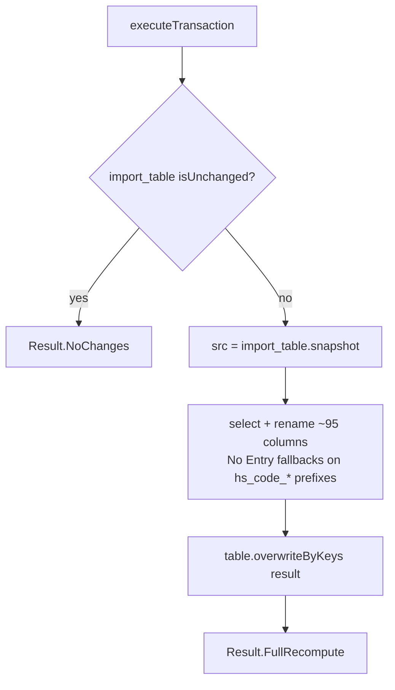

# IMPORT_REPORT_ALL_FINAL Workflow — Final Reshape (`overwriteByKeys`)

**File:** [`import_report_all_final.scala`](../../src/main/scala/ct/dna/lakehouse/dm_md/fin_regional_dashboard/import_report_all_final.scala)
**Pattern:** [C — derived recompute + `overwriteByKeys`](./README.md#pattern-c--derived-recompute--overwritebykeys-full-recompute)
**Output:** `Result.FullRecompute`

## Purpose

The published dashboard table. A single-source reshape of [`import_table`](./IMPORT_TABLE_WORKFLOW.md): it selects and **renames** columns into the consumer-facing schema (e.g. `budat → ekbe_budat`, `ekpo_netpr → netpr`, `hsc_* → cn_*/lev*`), applies `"No Entry"` fallbacks on the HS-code prefix columns, and writes via `overwriteByKeys`.

## Target schema

PK: `(_mk_system, _mk_instance, gjahr, belnr, ebeln, ebelp, buzei)` — note this is a **7-column** subset of the import_table key (`vgabe` and `zekkn` are dropped). The rest are renamed pass-throughs and the HS-code description hierarchy flattened to dashboard names (`cnkey`, `level`, `cn_description`, `cn_code`, `goods_code`, `lev6`–`lev12`, `hs_code_2`–`hs_code_8`, etc.).

## Sources

[`import_table`](./IMPORT_TABLE_WORKFLOW.md) only.

## Execution flow

## Notes

- No joins — grain is inherited directly from `import_table`, so `overwriteByKeys` is trivially safe **provided** the 7-column key is unique. Because `vgabe`/`zekkn` are dropped from the PK, uniqueness relies on those being constant within each `(gjahr, belnr, ebeln, ebelp, buzei)` group for the dashboard grain.
- Column renames map SAP/internal names to dashboard-friendly names: e.g. `lfa1_land1 → lifnr_land`, `t001w_land1 → werks_land`, `lfa1_name1 → lifnr_name1`, `mbew_peinh → peinh`, `menge → ekbe_menge`.
- HS-code prefix columns (`hs_code_2`, `hs_code_3`, …) get a `when(isNull || trim = "", "No Entry")` fallback.
</content>
