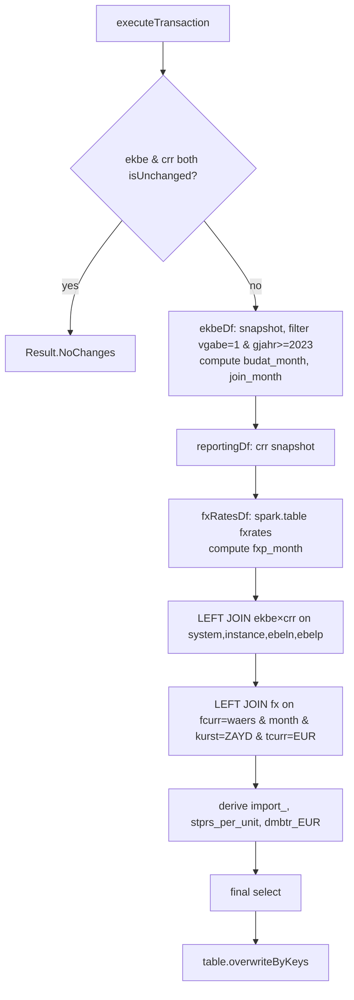

# IMPORT_TABLE Workflow — FX Conversion Join (`overwriteByKeys`)

**File:** [`import_table.scala`](../../src/main/scala/ct/dna/lakehouse/dm_md/fin_regional_dashboard/import_table.scala)
**Pattern:** [C — derived recompute + `overwriteByKeys`](./README.md#pattern-c--derived-recompute--overwritebykeys-full-recompute)
**Output:** `Result.FullRecompute`

## Purpose

Joins the EKBE transaction grain to the wide [`customs_regional_reporting`](./CUSTOMS_REGIONAL_REPORTING_WORKFLOW.md) row, attaches the FX rate for the posting month, and derives the trade classification (`import_`), per-unit standard price (`stprs_per_unit`) and the EUR-converted amount (`dmbtr_eur`). One row per EKBE document key.

## Target schema (highlights)

PK: the 9-column EKBE document key (`_mk_system, _mk_instance, gjahr, vgabe, zekkn, belnr, ebeln, ebelp, buzei`). Carries all EKBE columns, the full `customs_regional_reporting` projection (`ekko_*`, `ekpo_*`, `lfa1_*`, `t001_*`, `mbew_*`, `marc_*`, `hscode*`, `hsc_*`, `mara_*`, `matkl_text`, `t001w_*`) plus the derived fields:

| Column | Type | Derivation |
|---|---|---|
| `fx_rate` | Double | `fxrates.final_rate` for the matched month |
| `import_` | String | `Domestic-Trade` / `EU-Trade` / `import` |
| `stprs_per_unit` | Double | valuation- or price-based per-unit cost |
| `dmbtr_eur` | Double | EUR-converted, sign-aware amount |

## Sources

- [`ekbe`](./EKBE_WORKFLOW.md) and [`customs_regional_reporting`](./CUSTOMS_REGIONAL_REPORTING_WORKFLOW.md) (this package, via the change-feed framework).
- `dw_tx.fin_fxrates.fxrates` — read **directly** via `spark.table("dw_tx.fin_fxrates.fxrates")` (not a declared `sourceTableSpec`, so it does not participate in `isUnchanged` short-circuiting).

## Execution flow

## Month-bucket FX join

`budat` is a SAP `yyyyMMdd` string. The join uses **month buckets** rather than exact dates so a missing rate for a specific day still resolves:

- `budat_month = date_trunc("month", to_date(budat, "yyyyMMdd"))`.
- `join_month`: if `budat_month` is the current month, shift back one month (`add_months(-1)`) — current-month rates may be incomplete, so always hit a fully-settled month.
- FX side: `fxp_month = date_trunc("month", rate_date)`.
- Match condition: `fcurr = ekbe.waers AND fxp_month = ekbe.join_month AND kurst = "ZAYD" AND tcurr = "EUR"`.

## Derived fields

**`import_`** (trade classification):

| Condition | Value |
|---|---|
| `t001w_iso_code = lfa1_iso_code` | `Domestic-Trade` |
| both EU members & iso codes differ | `EU-Trade` |
| otherwise | `import` |

**`stprs_per_unit`**: when `ekpo_pstyp = "2"` → `mbew_stprs / mbew_peinh` (zero-safe); else `(ekpo_netpr / ekpo_peinh) * ekbe.menge` (zero-safe).

**`dmbtr_EUR`**: divides `stprs_per_unit` by a zero-safe `fx_rate` when `waers ≠ EUR`, and negates when `shkzg = "H"` (credit).

## Downstream

Consumed by [`import_report_all_final`](./IMPORT_REPORT_ALL_FINAL_WORKFLOW.md), which reshapes/renames it into the published dashboard table.
</content>
