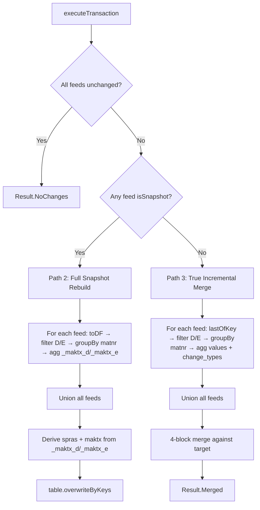
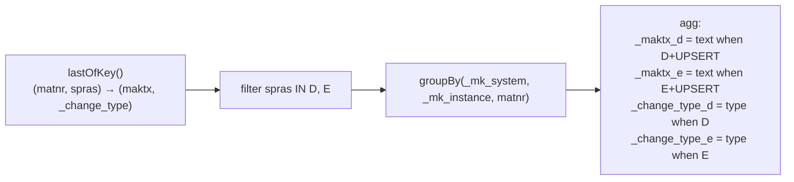
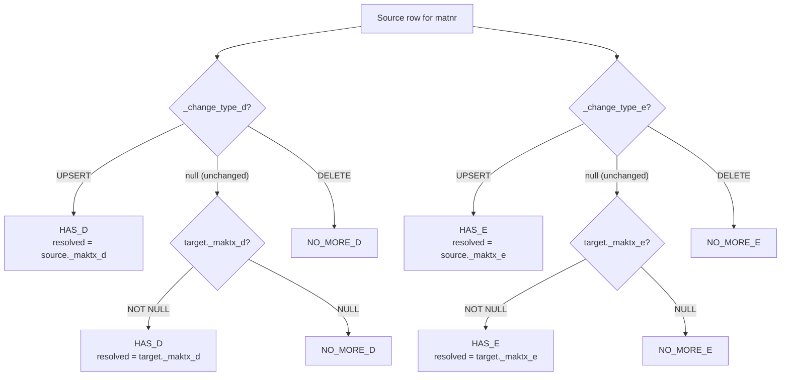
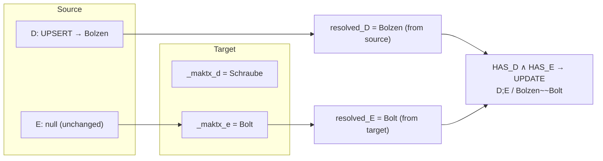
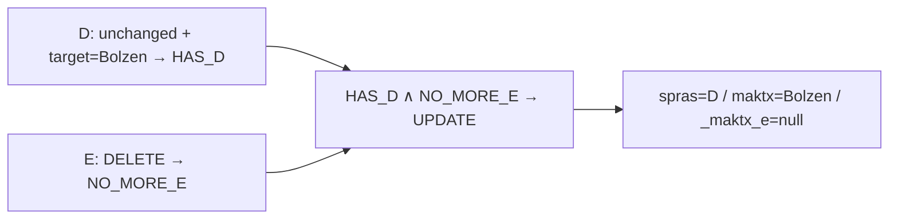

# MAKT Workflow — Incremental Merge with Change Data Feed

## Overview

`makt` aggregates SAP material descriptions from 13 source systems into a single denormalized target table.
Each source row has a language key (`spras`): we only keep **D** (German) and **E** (English), combining them
into one target row per `(_mk_system, _mk_instance, matnr)`.

## Target Schema

| Column | Type | Description |
|---|---|---|
| `_mk_system` | String **PK** | SAP system ID |
| `_mk_instance` | String **PK** | SAP instance |
| `matnr` | String **PK** | Material number |
| `spras` | String | Derived: `"D"`, `"E"`, or `"D;E"` — only lists languages with non-null text |
| `maktx` | String | Derived: `"textD~~textE"` — only includes non-null texts, joined by `~~` |
| `_maktx_d` | String | German text (nullable) |
| `_maktx_e` | String | English text (nullable) |

**Rule:** If a text column is null, its language letter is omitted from `spras` and `maktx`.

---

## Execution Flow



---

## Path 2 — Snapshot Rebuild (First Run / CDF Unavailable)

At least one feed reports `isSnapshot` → full rebuild via `overwriteByKeys`.

### Source Rows (e32 snapshot)

| _mk_system | _mk_instance | matnr | spras | maktx |
|---|---|---|---|---|
| SAP | E32 | MAT-001 | D | Schraube |
| SAP | E32 | MAT-001 | E | Bolt |
| SAP | E32 | MAT-002 | D | Mutter |
| SAP | E32 | MAT-003 | E | Washer |

### After groupBy + agg → Target

| _mk_system | _mk_instance | matnr | spras | maktx | _maktx_d | _maktx_e |
|---|---|---|---|---|---|---|
| SAP | E32 | MAT-001 | D;E | Schraube~~Bolt | Schraube | Bolt |
| SAP | E32 | MAT-002 | D | Mutter | Mutter | *null* |
| SAP | E32 | MAT-003 | E | Washer | *null* | Washer |

---

## Path 3 — True Incremental (4-Block Merge)

All feeds have CDF available. Uses `lastOfKey()` which provides per-PK changes with `_change_type` ∈ {`UPSERT`, `DELETE`}.

### Step 1: `groupChanges` — Pivot CDF by Language



**Input: `lastOfKey()` from one source feed**

| _mk_system | _mk_instance | matnr | spras | maktx | _change_type |
|---|---|---|---|---|---|
| SAP | E32 | MAT-001 | D | Bolzen | UPSERT |
| SAP | E32 | MAT-002 | D | *(n/a)* | DELETE |
| SAP | E32 | MAT-004 | D | Feder | UPSERT |
| SAP | E32 | MAT-004 | E | Spring | UPSERT |

**After `groupChanges`:**

| _mk_system | _mk_instance | matnr | _maktx_d | _maktx_e | _change_type_d | _change_type_e |
|---|---|---|---|---|---|---|
| SAP | E32 | MAT-001 | Bolzen | *null* | UPSERT | *null* |
| SAP | E32 | MAT-002 | *null* | *null* | DELETE | *null* |
| SAP | E32 | MAT-004 | Feder | Spring | UPSERT | UPSERT |

Key rules:
- `_maktx_d`/`_maktx_e`: only populated when `_change_type` is `UPSERT` (deleted text is discarded)
- `_change_type_d`/`_change_type_e`: `UPSERT`, `DELETE`, or `null` (language not in CDF = unchanged)

### Step 2: Merge — 2×2 Decision Matrix

Per language, the outcome is binary:

```
HAS_X     = UPSERT  OR  (UNCHANGED and target already has a value)
NO_MORE_X = DELETE   OR  (UNCHANGED and target has no value)
resolvedX = coalesce(source._maktx_x, target._maktx_x)
```



### Merge Block Decision Table

| | **HAS_E** | **NO_MORE_E** |
|---|---|---|
| **HAS_D** | UPDATE: `D;E` / `resolvedD~~resolvedE` | UPDATE: `D` / `resolvedD` |
| **NO_MORE_D** | UPDATE: `E` / `resolvedE` | DELETE row |

Plus: **whenNotMatched** (at least one UPSERT) → INSERT

---

## Example Walkthrough

### Current Target Before Merge

| matnr | spras | maktx | _maktx_d | _maktx_e |
|---|---|---|---|---|
| MAT-001 | D;E | Schraube~~Bolt | Schraube | Bolt |
| MAT-002 | D | Mutter | Mutter | *null* |
| MAT-003 | E | Washer | *null* | Washer |

### Grouped CDF Source

| matnr | _maktx_d | _maktx_e | _change_type_d | _change_type_e |
|---|---|---|---|---|
| MAT-001 | Bolzen | *null* | UPSERT | *null* |
| MAT-002 | *null* | *null* | DELETE | *null* |
| MAT-004 | Feder | Spring | UPSERT | UPSERT |

---

### MAT-001 — German text updated, English unchanged



| Lang | _change_type | source | target | resolved | Outcome |
|---|---|---|---|---|---|
| D | UPSERT | Bolzen | Schraube | **Bolzen** | HAS_D |
| E | *null* | *null* | Bolt | **Bolt** | HAS_E |

→ **HAS_D ∧ HAS_E** → UPDATE

| matnr | spras | maktx | _maktx_d | _maktx_e |
|---|---|---|---|---|
| MAT-001 | D;E | Bolzen~~Bolt | Bolzen | Bolt |

---

### MAT-002 — German deleted, English was already absent

| Lang | _change_type | source | target | Outcome |
|---|---|---|---|---|
| D | DELETE | *null* | Mutter | NO_MORE_D |
| E | *null* | *null* | *null* | NO_MORE_E (unchanged + target null) |

→ **NO_MORE_D ∧ NO_MORE_E** → DELETE

MAT-002 removed from target.

---

### MAT-003 — Not in CDF

Not in grouped source → **not touched by merge** → stays as-is.

---

### MAT-004 — Brand new material, both languages

| Lang | _change_type | source | Outcome |
|---|---|---|---|
| D | UPSERT | Feder | has value |
| E | UPSERT | Spring | has value |

→ **whenNotMatched** (at least one UPSERT) → INSERT

| matnr | spras | maktx | _maktx_d | _maktx_e |
|---|---|---|---|---|
| MAT-004 | D;E | Feder~~Spring | Feder | Spring |

---

### Final Target After Merge

| matnr | spras | maktx | _maktx_d | _maktx_e |
|---|---|---|---|---|
| MAT-001 | D;E | Bolzen~~Bolt | Bolzen | Bolt |
| MAT-003 | E | Washer | *null* | Washer |
| MAT-004 | D;E | Feder~~Spring | Feder | Spring |

---

## Additional Scenarios

### Scenario: English deleted, German still exists

**CDF:** `MAT-001, spras=E, DELETE`



| Lang | _change_type | target | Outcome |
|---|---|---|---|
| D | *null* | Bolzen | HAS_D (unchanged + target exists) |
| E | DELETE | Bolt | NO_MORE_E |

→ **HAS_D ∧ NO_MORE_E** → UPDATE → `D` / `Bolzen` / `_maktx_e=null`

---

### Scenario: New material with German only

**CDF:** `MAT-005, spras=D, UPSERT, maktx=Dichtung`

| Lang | _change_type | source |
|---|---|---|
| D | UPSERT | Dichtung |
| E | *null* | *null* |

→ **whenNotMatched** → INSERT → `D` / `Dichtung` / `_maktx_e=null`

---

### Scenario: Both languages deleted

**CDF:** `MAT-001, spras=D, DELETE` + `MAT-001, spras=E, DELETE`

→ **NO_MORE_D ∧ NO_MORE_E** → DELETE — row removed.

---

### Scenario: German unchanged, English updated

**CDF:** `MAT-001, spras=E, UPSERT, maktx=Screw`

| Lang | _change_type | source | target | resolved |
|---|---|---|---|---|
| D | *null* | *null* | Bolzen | Bolzen (from target) |
| E | UPSERT | Screw | Bolt | Screw (from source) |

→ **HAS_D ∧ HAS_E** → UPDATE → `D;E` / `Bolzen~~Screw`

---

## Merge Block Summary

| # | Condition | Action | spras | maktx |
|---|---|---|---|---|
| 1 | HAS_D ∧ HAS_E | UPDATE | `D;E` | `resolvedD~~resolvedE` |
| 2 | HAS_D ∧ NO_MORE_E | UPDATE | `D` | `resolvedD` |
| 3 | NO_MORE_D ∧ HAS_E | UPDATE | `E` | `resolvedE` |
| 4 | NO_MORE_D ∧ NO_MORE_E | DELETE | — | — |
| 5 | whenNotMatched (any UPSERT) | INSERT | derived | derived |

Where:
- **HAS_X** = `UPSERT` OR (`UNCHANGED` AND target has value)
- **NO_MORE_X** = `DELETE` OR (`UNCHANGED` AND target is null)
- **resolvedX** = `coalesce(source._maktx_x, target._maktx_x)` — picks source for UPSERT, carries forward target for UNCHANGED
